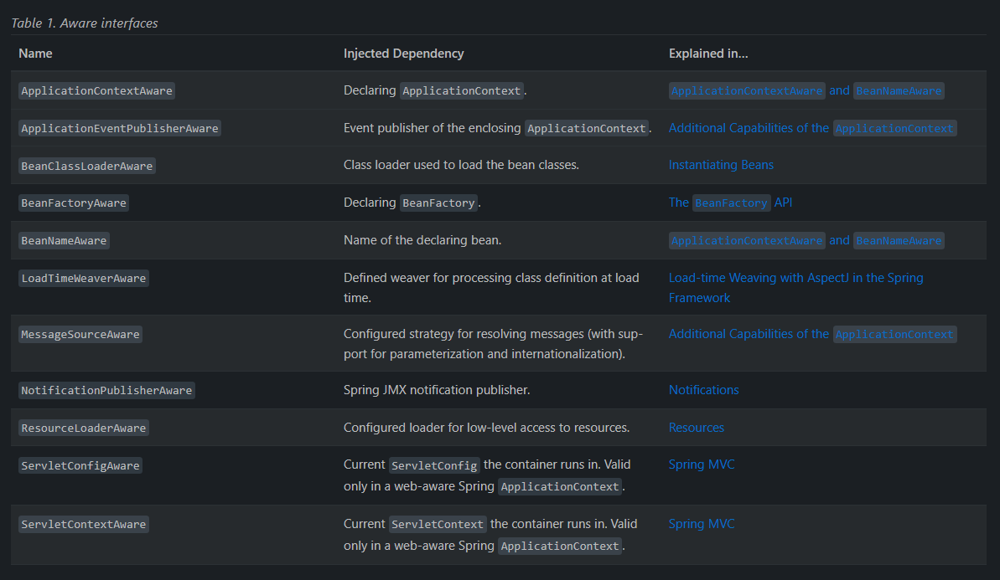
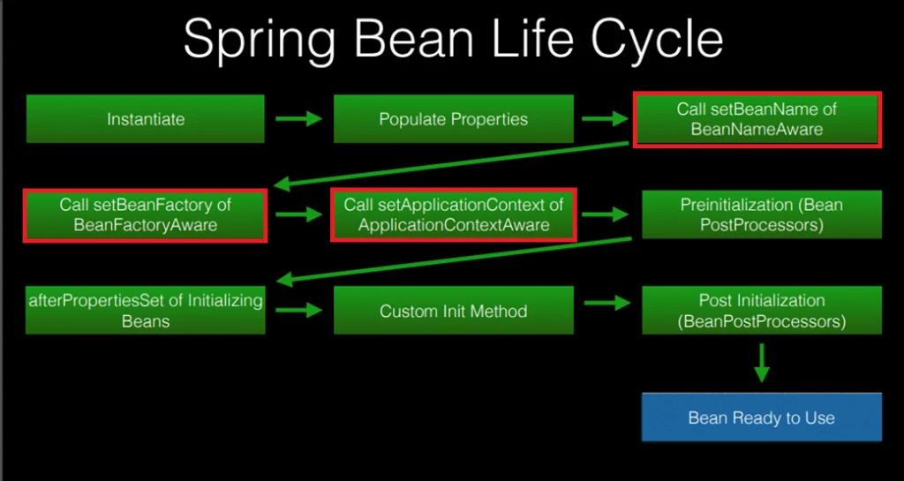
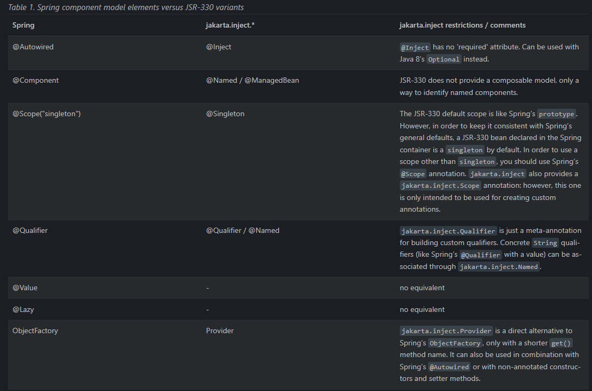

# Spring IoC Container - Complete Guide

## Overview

The **IoC (Inversion of Control) Container** is the core of the Spring Framework. It manages the lifecycle and
configuration of application objects (beans).

---

## Table of Contents

- [What is IoC?](#what-is-ioc)
- [Bean Definition](#bean-definition)
- [Dependency Injection](#dependency-injection)
- [Lazy Initialization](#lazy-initialization)
- [Method Injection](#method-injection)
- [Bean Scopes](#bean-scopes)
- [Bean Lifecycle](#bean-lifecycle)
- [Configuration Styles](#configuration-styles)
- [ApplicationContext](#applicationcontext)
- [Interview Questions](#interview-questions)

---

## What is IoC?

**Inversion of Control** means the framework controls the flow of the program and creates objects, rather than the
developer creating objects manually.

### Traditional Approach (No IoC)

```java
public class UserService {
    private UserRepository repository = new UserRepository(); // Tight coupling

    public void saveUser(User user) {
        repository.save(user);
    }
}
```

### Spring IoC Approach

```java

@Service
public class UserService {
    private final UserRepository repository;

    @Autowired  // Spring injects dependency
    public UserService(UserRepository repository) {
        this.repository = repository;
    }
}
```

**Benefits of IoC:**

- ✅ Loose coupling
- ✅ Easy testing (can inject mocks)
- ✅ Better maintainability
- ✅ Centralized configuration

---

## Bean Definition

A **bean** is an object managed by the Spring IoC container. A bean is an object that is instantiated, assembled, and
managed by a Spring IoC container

In addition to bean definitions that contain information on how to create a specific bean, the ApplicationContext
implementations also permit the registration of existing objects that are created outside the container (by users).
This is done by accessing the ApplicationContext’s BeanFactory through the getAutowireCapableBeanFactory() method, which
returns the DefaultListableBeanFactory implementation.
DefaultListableBeanFactory supports this registration through the registerSingleton(..) and registerBeanDefinition(..)
methods.

However, typical applications work solely with beans defined through regular bean definition metadata.

### Instantiating Beans

A bean definition is essentially a recipe for creating one or more objects.
The container looks at the recipe for a named bean when asked and uses the configuration metadata encapsulated by that
bean definition to create (or acquire) an actual object.

### Instantiation with a Static Factory Method

When defining a bean that you create with a static factory method, use the class attribute to specify the class that
contains the static factory method and an attribute named factory-method to specify the name of the factory method
itself.
You should be able to call this method (with optional arguments, as described later) and return a live object, which
subsequently is treated as if it had been created through a constructor.
One use for such a bean definition is to call static factories in legacy code.

The following bean definition specifies that the bean will be created by calling a factory method.
The definition does not specify the type (class) of the returned object, but rather the class containing the factory
method.
In this example, the createInstance() method must be a static method. The following example shows how to specify a
factory method:

```
<bean id="clientService"
class="examples.ClientService"
factory-method="createInstance"/>
```

A typical problematic case with factory method overloading is Mockito with its many overloads of the mock method. Choose
the most specific variant of mock possible:

````
<bean id="clientService" class="org.mockito.Mockito" factory-method="mock">
	<constructor-arg type="java.lang.Class" value="examples.ClientService"/>
	<constructor-arg type="java.lang.String" value="clientService"/>
</bean>
````

### Instantiation by Using an Instance Factory Method

Similar to instantiation through a static factory method , instantiation with an instance factory method invokes a
non-static method of an existing bean from the container to create a new bean. To use this mechanism, leave the class
attribute empty and, in the factory-bean attribute, specify the name of a bean in the current (or parent or ancestor)
container that contains the instance method that is to be invoked to create the object. Set the name of the factory
method itself with the factory-method attribute. The following example shows how to configure such a bean:

````xml
<!-- the factory bean, which contains a method called createClientServiceInstance() -->
<bean id="serviceLocator" class="examples.DefaultServiceLocator">
    <!-- inject any dependencies required by this locator bean -->
</bean>
````

````xml
<!-- the bean to be created via the factory bean -->
<bean id="clientService"
      factory-bean="serviceLocator"
      factory-method="createClientServiceInstance"/>
````

````java
public class DefaultServiceLocator {

    private static ClientService clientService = new ClientServiceImpl();

    public ClientService createClientServiceInstance() {
        return clientService;
    }
} 
````

### Determining a Bean’s Runtime Type

The recommended way to find out about the actual runtime type of a particular bean is a BeanFactory.getType call for the
specified bean name.

### Ways to Define Beans

#### 1. XML Configuration

```xml

<beans>
    <bean id="userService" class="com.example.UserService">
        <property name="userRepository" ref="userRepository"/>
    </bean>

    <bean id="userRepository" class="com.example.UserRepository"/>
</beans>
```

#### 2. Java Configuration (@Configuration)

```java

@Configuration
public class AppConfig {

    @Bean
    public UserService userService() {
        return new UserService(userRepository());
    }

    @Bean
    public UserRepository userRepository() {
        return new UserRepository();
    }
}
```

#### 3. Component Scanning (@Component, @Service, @Repository)

```java

@Service
public class UserService {
    // Automatically detected and registered as bean
}

@Repository
public class UserRepository {
    // Automatically detected and registered as bean
}
```

#### 4. @Bean Method

```java

@Configuration
public class DatabaseConfig {

    @Bean
    public DataSource dataSource() {
        HikariDataSource ds = new HikariDataSource();
        ds.setJdbcUrl("jdbc:postgresql://localhost:5432/mydb");
        ds.setUsername("user");
        ds.setPassword("pass");
        return ds;
    }
}
```

---

## Dependency Injection

Spring supports three types of dependency injection:

### 1. Constructor Injection (Recommended)

```java

@Service
public class OrderService {
    private final UserService userService;
    private final PaymentService paymentService;

    @Autowired  // Optional since Spring 4.3 if only one constructor
    public OrderService(UserService userService, PaymentService paymentService) {
        this.userService = userService;
        this.paymentService = paymentService;
    }
}
```

**Advantages:**

- ✅ Immutable (final fields)
- ✅ Required dependencies are clear
- ✅ Easy to test
- ✅ No reflection needed

### 2. Setter Injection

```java

@Service
public class EmailService {
    private TemplateEngine templateEngine;

    @Autowired
    public void setTemplateEngine(TemplateEngine templateEngine) {
        this.templateEngine = templateEngine;
    }
}
```

**Use when:**

- Optional dependencies
- Dependencies can change at runtime

### 3. Field Injection (Not Recommended)

```java

@Service
public class ProductService {
    @Autowired
    private ProductRepository repository;  // Hard to test
}
```

**Disadvantages:**

- ❌ Cannot be final
- ❌ Hard to unit test
- ❌ Hidden dependencies

### Qualifier - Resolving Multiple Beans

```java

@Service
public class NotificationService {
    private final MessageSender sender;

    @Autowired
    public NotificationService(@Qualifier("emailSender") MessageSender sender) {
        this.sender = sender;
    }
}

@Component("emailSender")
public class EmailSender implements MessageSender {
}

@Component("smsSender")
public class SmsSender implements MessageSender {
}
```

### @Primary - Default Bean

```java

@Component
@Primary  // Use this by default
public class EmailSender implements MessageSender {
}

@Component
public class SmsSender implements MessageSender {
}
```

### depends-on

Sometimes dependencies between beans are less direct. In that cases you can use the depends-on attribute to specify a
dependency.
(beans specified in the depends-on attribute will be created before the bean that uses them).

```xml

<bean id="beanOne" class="ExampleBean" depends-on="manager,accountDao">
    <property name="manager" ref="manager"/>
</bean>

<bean id="manager" class="ManagerBean">
<bean id="accountDao" class="x.y.jdbc.JdbcAccountDao"/>
```

#### ⚠️ only for singleton beans

The depends-on attribute can specify both an initialization-time dependency and, in the case of singleton beans only, a
corresponding destruction-time dependency.
Dependent beans that define a depends-on relationship with a given bean are destroyed first, prior to the given bean
itself being destroyed. Thus, depends-on can also control shutdown order.

---

## Lazy Initialization

Spring supports lazy initialization of beans. This means that the bean is not created until the first time it is used (
first requested).

By default, ApplicationContext implementations eagerly create and configure all singleton beans as part of the
initialization process.

```java

@Bean
@Lazy
ExpensiveToCreateBean lazy() {
    return new ExpensiveToCreateBean();
}

@Bean
AnotherBean notLazy() {
    return new AnotherBean();
}
```

When a lazy-initialized bean is a dependency of a singleton bean that is not lazy-initialized, the ApplicationContext
creates the lazy-initialized bean at startup, because it must satisfy the singleton’s dependencies.

Configuration class can also be marked as lazy (all beans in the configuration class will be lazy):

```java

@Configuration
@Lazy
public class LazyConfiguration {
    // No bean will be pre-instantiated...
}
```

---

## Method Injection

Spring supports method injection for dependency injection.
Method injection is a way to inject dependencies into a bean using a method call.

In most application scenarios, most beans in the container are singletons. When a singleton bean needs to collaborate
with another singleton bean or a non-singleton bean needs to collaborate with another non-singleton bean,
you typically handle the dependency by defining one bean as a property of the other.
A problem arises when the bean lifecycles are different. Suppose singleton bean A needs to use non-singleton (prototype)
bean B, perhaps on each method invocation on A.
The container creates the singleton bean A only once, and thus only gets one opportunity to set the properties. The
container cannot provide bean A with a new instance of bean B every time one is needed.

```java
package fiona.apple;

// Spring-API imports

import org.springframework.beans.BeansException;
import org.springframework.context.ApplicationContext;
import org.springframework.context.ApplicationContextAware;

/**
 * A class that uses a stateful Command-style class to perform
 * some processing.
 */
public class CommandManager implements ApplicationContextAware {

    private ApplicationContext applicationContext;

    public Object process(Map commandState) {
        // grab a new instance of the appropriate Command
        Command command = createCommand();
        // set the state on the (hopefully brand new) Command instance
        command.setState(commandState);
        return command.execute();
    }

    protected Command createCommand() {
        // notice the Spring API dependency!
        return this.applicationContext.getBean("command", Command.class);
    }

    public void setApplicationContext(
            ApplicationContext applicationContext) throws BeansException {
        this.applicationContext = applicationContext;
    }
}
```   

When a **singleton** bean has a dependency on a **prototype** (or any non-singleton) bean in Spring, it creates a very
important lifecycle/scope problem.

Below is a clear explanation of what happens, why it’s a problem, and what patterns Spring provides to solve it.

---

# ✅ **What Happens: Singleton → Prototype Dependency**

A **singleton bean is created only once**, at application startup.

During its creation, Spring resolves and injects all dependencies **once** — including prototype beans.

So:

```text
singletonBean ----inject----> prototypeBean  (only once)
```

This means:

* Even though `prototype` scope means *“a new instance each time it’s needed”*,
* The singleton gets **only one instance** at startup,
* And **keeps using the same prototype instance forever**.

➡️ **Prototype loses its meaning** in this injection scenario.

---

# ⚠️ Why This Is a Problem

Prototype beans are typically used when you want:

* new state per use
* new object every time
* short-lived objects
* different behavior per call

But dependency injection works at startup → so the singleton ends up with:

* a *single* prototype instance
* shared across all uses
* violating prototype's intended semantics

---

# 📌 Example: Singleton Injects Prototype

```java

@Component
public class SingletonBean {

    @Autowired
    private PrototypeBean prototypeBean;

    public void doWork() {
        System.out.println(prototypeBean.hashCode());
    }
}
```

Calling `doWork()` 10 times prints the **same hashCode** → same instance.

---

# ✅ How To Correctly Inject Prototype Into Singleton

Spring provides **three solutions**.

---

## **1️⃣ Method Injection (@Lookup)** → recommended for simple cases

Spring dynamically overrides this method to return a **new prototype instance each call**.

```java

@Component
public abstract class SingletonBean {

    public void doWork() {
        PrototypeBean p = getPrototypeBean();
        System.out.println(p.hashCode());
    }

    @Lookup
    protected abstract PrototypeBean getPrototypeBean();
}
```

---

## **2️⃣ ObjectFactory / ObjectProvider**

Lightweight factory for retrieving fresh beans:

```java

@Component
public class SingletonBean {

    @Autowired
    private ObjectProvider<PrototypeBean> provider;

    public void doWork() {
        PrototypeBean p = provider.getObject(); // new instance every call
    }
}
```

---

## **3️⃣ Provider (JSR-330)**

From `javax.inject`:

```java

@Component
public class SingletonBean {

    @Inject
    private Provider<PrototypeBean> provider;

    public void doWork() {
        PrototypeBean p = provider.get();
    }
}
```

Both ObjectProvider and Provider are clean, thread-safe, and recommended.

---

# ❌ What *Not* To Do

### Don’t directly inject prototype bean into singleton:

```java

@Autowired
private PrototypeBean prototype; // WRONG if you expect new instances
```

It gives you **one prototype instance**, and the singleton uses it forever.

---

# 🚨 Edge Case: Other Non-Singleton Scopes

| Singleton Depends On | Problem?  | Why                                               |
|----------------------|-----------|---------------------------------------------------|
| **prototype**        | ❌ Yes     | loses new-instance behavior                       |
| **request**          | ❌ Yes     | singleton created before any request scope exists |
| **session**          | ❌ Yes     | same as above                                     |
| **application**      | ❌ No      | both are singletons                               |
| **custom scopes**    | ❌ Usually | lifecycle mismatch                                |

If a singleton depends on request/session scoped beans → **Spring will throw an error unless you use scoped proxies** (
`proxyMode = TARGET_CLASS`).

---

# 🧠 Why Does Spring Not “Automatically” Fix It?

Because Spring must follow **dependency injection rules**:

* Singleton created once → dependencies resolved once
* Spring does not create new dependencies each time a method is called
* To get dynamic behavior, you must explicitly request it (lookup, provider, proxy)

---

# 🔥 Summary

### **A singleton depending directly on a prototype bean is a broken design — the singleton will NOT get a new prototype

each time.**

To fix it:

✔ Use `@Lookup`
✔ Use `ObjectProvider`
✔ Use `Provider`
✔ Use `@Scope(proxyMode = ...)` to lazily resolve scoped beans

---

Great — here are the extended explanations and examples you might want (based on your “yeap”).

I’ll cover **all the important edge cases**:

# ✅ 1. How Scoped Proxies Fix "Singleton → Request/Session" Dependencies

A **singleton cannot depend directly on request or session scoped beans**, because those scopes do not exist at
application startup.
Spring solves this via **scoped proxies**.

Example:

```java

@Component
@Scope(value = WebApplicationContext.SCOPE_REQUEST, proxyMode = ScopedProxyMode.TARGET_CLASS)
public class RequestScopedBean {
    // new instance per HTTP request
}
```

Now when a singleton injects it:

```java

@Component
public class SingletonBean {
    @Autowired
    private RequestScopedBean requestBean;
}
```

What actually gets injected is:

* a **CGLIB proxy**
* stored in the singleton
* the proxy internally fetches the real request-scoped bean **on each request**

This fixes lifecycle mismatch.

---

# ✅ 2. How Proxies Affect AOP, Transactions, and Auto-Proxying

### **If a bean is not proxied when Spring expects it to be, AOP will NOT work.**

Typical examples:

### Case 1 — Prototype → Transactional

```java

@Component
@Scope("prototype")
@Transactional
public class MyPrototype {
}
```

This will **NOT** work reliably:

* Spring applies transaction proxies during bean creation.
* Prototype beans are created *every time you call getBean()*.
* So transaction proxying must happen **each time**, but Spring does not do that automatically.

→ Solution: prototype must be retrieved through ObjectProvider or @Lookup so Spring can wrap it properly.

---

### Case 2 — Singleton receives prototype before proxying is applied

This is tied to what you asked earlier:

> “…which may result in injecting unexpected beans, affecting their eligibility for post-processing like auto-proxying.”

This happens when:

* A prototype bean is injected into a singleton **early**
* BeanPostProcessors (such as AOP proxy creators) run **afterward**
* That prototype bean is now **already fully created** and injected unproxied
* So **Spring cannot replace it with a proxy anymore**

Result:
Transaction, security, caching, aspects → **won’t work** for that bean.

---

# 🧪 Example: Wrong injection – prototype not proxied

```java

@Component
@Scope("prototype")
public class Worker {
    @Transactional
    public void process() {
    }
}
```

```java

@Component
public class Job {
    @Autowired
    private Worker worker;
}
```

What happens:

1. Worker created (non-proxied)
2. Injected into Job (singleton)
3. THEN proxying is attempted → Too late!
4. `@Transactional` does nothing → because the proxy is missing

---

# 🛠 Correct way: Use `ObjectProvider`

```java

@Component
public class Job {

    @Autowired
    private ObjectProvider<Worker> workerProvider;

    public void run() {
        Worker w = workerProvider.getObject();  // freshly created + proxied
        w.process();  // transactions now work
    }
}
```

This forces Spring to:

* create the bean *on demand*
* apply BPPs (including auto-proxying)
* return the fully wrapped bean to you

---

# 🛠 Correct way: Use `@Lookup`

```java

@Component
public abstract class Job {

    public void run() {
        Worker w = newWorker();
        w.process();
    }

    @Lookup
    protected abstract Worker newWorker();
}
```

---

# 🛠 Correct way: Use Scoped Proxy (for Web scopes)

```java

@Component
@Scope(value = SCOPE_REQUEST, proxyMode = TARGET_CLASS)
public class RequestScopedService {
}

@Component
public class Controller {
    @Autowired
    private RequestScopedService service; // injected as proxy
}
```

---

# ✅ 3. Performance Considerations

### ObjectProvider

* Lightweight
* Zero performance penalty
* Recommended for prototype beans

### @Lookup

* Uses method overriding through CGLIB
* Slightly slower
* More “magic”, less explicit

### Scoped Proxies

* Perfect for web scopes
* Slight overhead due to proxying, but negligible

---

# ⭐ Final Summary

**A singleton bean must NOT directly depend on a prototype or request/session scoped bean**, because:

* the dependency is resolved **once**
* post-processing (AOP, proxying) may not be applied
* lifecycle boundaries are violated

### Use these instead:

| Problem                                     | Correct Solution                            |
|---------------------------------------------|---------------------------------------------|
| Singleton → Prototype                       | `ObjectProvider`, `Provider`, `@Lookup`     |
| Singleton → Request/Session                 | Scoped proxy (`proxyMode = TARGET_CLASS`)   |
| Need transactions/security inside prototype | Must be created on demand (provider/lookup) |
| Bean loses AOP proxy                        | Inject via provider, not field injection    |

---

## Bean Scopes

Spring provides several bean scopes:

### 1. Singleton (Default)

```java

@Service
@Scope("singleton")  // Optional, this is default
public class UserService {
    // Single instance per Spring container
}
```


**Characteristics:**

- One instance per ApplicationContext (multiple instances id multiple containers)
- Shared across all requests
- Stateless preferred

### 2. Prototype

```java

@Service
@Scope("prototype")
public class ShoppingCart {
    // New instance each time requested
}
```


**Use when:**

- Stateful beans
- Each client needs separate instance
- In contrast to the other scopes, Spring does not manage the complete lifecycle of a prototype bean. The container
  instantiates, configures, and otherwise assembles a prototype object and hands it to the client, with no further
  record of that prototype instance.(@PreDestroy is not called for prototype beans)
- The client code must clean up prototype-scoped objects and release expensive resources that the prototype beans hold.
- You can use a custom bean post-processor which holds a reference to beans that need to be cleaned up

####

Singleton Beans with Prototype-bean Dependencies
When you use singleton-scoped beans with dependencies on prototype beans, be aware that dependencies are resolved at
instantiation time.
Thus, if you dependency-inject a prototype-scoped bean into a singleton-scoped bean, a new prototype bean is
instantiated and then dependency-injected into the singleton bean.
The prototype instance is the sole instance that is ever supplied to the singleton-scoped bean.

However, suppose you want the singleton-scoped bean to acquire a new instance of the prototype-scoped bean repeatedly at
runtime.
You cannot dependency-inject a prototype-scoped bean into your singleton bean, because that injection occurs only once,
when the Spring container instantiates the singleton bean and resolves and injects its dependencies. (See
the [Method Injection](#method-injection) section for more information.)

### Request, Session, Application, and WebSocket Scopes

The request, session, application, and websocket scopes are available only if you use a web-aware Spring
ApplicationContext implementation (such as XmlWebApplicationContext).
If you use these scopes with regular Spring IoC containers, such as the ClassPathXmlApplicationContext,
an IllegalStateException that complains about an unknown bean scope is thrown.

If you access scoped beans within Spring Web MVC, in effect, within a request that is processed by the Spring
DispatcherServlet, no special setup is necessary. DispatcherServlet already exposes all relevant state.

If you use a Servlet web container, with requests processed outside of Spring’s DispatcherServlet (for example, when
using JSF),
you need to register the org.springframework.web.context.request.RequestContextListener ServletRequestListener.
This can be done programmatically by using the WebApplicationInitializer interface.
Alternatively, add the following declaration to your web application’s web.xml file:

```xml

<web-app>
    ...
    <listener>
        <listener-class>
            org.springframework.web.context.request.RequestContextListener
        </listener-class>
    </listener>
    ...
</web-app>
```

Alternatively, if there are issues with your listener setup, consider using Spring’s RequestContextFilter. The filter
mapping depends on the surrounding web application configuration, so you have to change it as appropriate.
The following listing shows the filter part of a web application:

```xml

<web-app>
    ...
    <filter>
        <filter-name>requestContextFilter</filter-name>
        <filter-class>org.springframework.web.filter.RequestContextFilter</filter-class>
    </filter>
    <filter-mapping>
        <filter-name>requestContextFilter</filter-name>
        <url-pattern>/*</url-pattern>
    </filter-mapping>
    ...
</web-app>
```

DispatcherServlet, RequestContextListener, and RequestContextFilter all do exactly the same thing, namely bind the HTTP
request object to the Thread that is servicing that request.
This makes beans that are request- and session-scoped available further down the call chain.

#### 3. Request (Web Applications)

```java

@Component
@Scope(value = WebApplicationContext.SCOPE_REQUEST, proxyMode = ScopedProxyMode.TARGET_CLASS)
public class LoginForm {
    // New instance per HTTP request
}
```

#### 4. Session (Web Applications)

```java

@Component
@Scope(value = WebApplicationContext.SCOPE_SESSION, proxyMode = ScopedProxyMode.TARGET_CLASS)
public class UserSession {
    // New instance per HTTP session
}
```

#### 5. Application (Web Applications)

```java

@Component
@Scope(value = WebApplicationContext.SCOPE_APPLICATION, proxyMode = ScopedProxyMode.TARGET_CLASS)
public class AppCache {
    // Single instance per ServletContext
}
```

The Spring container creates a new instance of the AppPreferences bean by using the appPreferences bean definition once
for the entire web application.
That is, the appPreferences bean is scoped at the ServletContext level and stored as a regular ServletContext attribute.
This is somewhat similar to a Spring singleton bean but differs in two important ways:

- It is a singleton per ServletContext, not per Spring ApplicationContext (for which there may be several in any given
  web application), and it is actually exposed and therefore visible as a ServletContext attribute.

### Custom Scope

```java
public class TenantScope implements Scope {
    // Custom scope implementation
}
```

You should register your custom scope with the Spring container

1. xml approach
    ```xml
    
    <bean class="org.springframework.beans.factory.config.CustomScopeConfigurer">
        <property name="scopes">
            <map>
                <entry key="thread">
                    <bean class="org.springframework.context.support.SimpleThreadScope"/>
                </entry>
            </map>
        </property>
    </bean>
    ```

2. java approach

    ```java
    Scope threadScope = new SimpleThreadScope();
    beanFactory.registerScope("thread",threadScope);
    ```

📝 When you place <aop:scoped-proxy/> within a <bean> declaration for a FactoryBean implementation,
it is the factory bean itself that is scoped, not the object returned from getObject().

### Customizing the Nature of a Bean

* Lifecycle Callbacks

* ApplicationContextAware and BeanNameAware

* Other Aware Interfaces

#### Lifecycle Callbacks

[💡Tip]
The JSR-250 @PostConstruct and @PreDestroy annotations are generally considered best practice for receiving lifecycle
callbacks in a modern Spring application.
Using these annotations means that your beans are not coupled to Spring-specific interfaces.
For details, see Using @PostConstruct and @PreDestroy.
If you do not want to use the JSR-250 annotations, but you still want to remove coupling,
consider init-method and destroy-method bean definition metadata.

The Spring Framework uses BeanPostProcessor implementations to process any callback interfaces it can find and call the
appropriate methods.

##### Initialization Callbacks

The org.springframework.beans.factory.InitializingBean interface lets a bean perform initialization work after the
container has set all necessary properties on the bean.

```java
void afterPropertiesSet() throws Exception;
```

```note
[💡Tip]
We recommend that you do not use the InitializingBean interface, because it unnecessarily couples the code to Spring.
Alternatively, we suggest using the @PostConstruct annotation or specifying a POJO initialization method. In the case of XML-based configuration metadata,
you can use the init-method attribute to specify the name of the method that has a void no-argument signature.

Be aware that @PostConstruct and initialization methods in general are executed within the container’s singleton creation lock.
The bean instance is only considered as fully initialized and ready to be published to others after returning from the @PostConstruct method.
Such individual initialization methods are only meant for validating the configuration state and possibly preparing some data structures based on the given configuration but no further activity with external bean access.
Otherwise there is a risk for an initialization deadlock.

For a scenario where expensive post-initialization activity is to be triggered, for example, asynchronous database preparation steps, your bean should either implement SmartInitializingSingleton.afterSingletonsInstantiated()
or rely on the context refresh event: implementing ApplicationListener<ContextRefreshedEvent> or declaring its annotation equivalent @EventListener(ContextRefreshedEvent.class).
Those variants come after all regular singleton initialization and therefore outside of any singleton creation lock.

Alternatively, you may implement the (Smart)Lifecycle interface and integrate with the container’s overall lifecycle management,
including an auto-startup mechanism, a pre-destroy stop step, and potential stop/restart callbacks (see below).
```

---

## 🧩 The Problem Being Solved

Sometimes a Spring bean needs to:

✔ Trigger **post-initialization** logic
✔ Only after **all** Spring singletons are created
✔ **Outside** the bean-creation lock (so async tasks don’t block startup)

Examples:

* Async DB preparation
* Caches warming
* Scheduling background jobs
* External service sync

To do that, Spring provides **three proper hooks** 👇

---

## ✔ Option 1 — `SmartInitializingSingleton.afterSingletonsInstantiated()`

Called **after all singletons are created**, before app fully ready.
Perfect for async initialization tasks.

```java
import org.springframework.beans.factory.SmartInitializingSingleton;
import org.springframework.stereotype.Component;

@Component
public class CacheInitializer implements SmartInitializingSingleton {

    @Override
    public void afterSingletonsInstantiated() {
        System.out.println("Running async setup...");
        // Start expensive tasks here
    }
}
```

🔹 No dependency on ApplicationContext
🔹 Guaranteed to run **once**
🔹 Runs **before** ContextRefreshedEvent

---

## ✔ Option 2 — `ApplicationListener<ContextRefreshedEvent>`

Runs when the Spring context is **fully** refreshed and ready.

```java
import org.springframework.context.event.ContextRefreshedEvent;
import org.springframework.context.ApplicationListener;
import org.springframework.stereotype.Component;

@Component
public class StartupListener implements ApplicationListener<ContextRefreshedEvent> {

    @Override
    public void onApplicationEvent(ContextRefreshedEvent event) {
        System.out.println("App is fully initialized!");
    }
}
```

Or shorter with annotations:

```java

@Component
public class StartupEventHandler {

    @EventListener(ContextRefreshedEvent.class)
    public void onRefresh() {
        System.out.println("App started — run init jobs here");
    }
}
```

---

## ✔ Option 3 — `Lifecycle` / `SmartLifecycle`

Good when the bean needs:
✔ Auto-start behavior
✔ Graceful stop on shutdown
✔ Restart capabilities

```java
import org.springframework.context.SmartLifecycle;
import org.springframework.stereotype.Component;

@Component
public class MyLifecycleBean implements SmartLifecycle {

    private boolean running = false;

    @Override
    public void start() {
        running = true;
        System.out.println("Lifecycle start — job scheduling begins");
    }

    @Override
    public void stop() {
        running = false;
        System.out.println("Lifecycle stop — cleanup here");
    }

    @Override
    public boolean isRunning() {
        return running;
    }

    @Override
    public int getPhase() {
        return 0; // Lower = start earlier
    }

    @Override
    public boolean isAutoStartup() {
        return true; // start automatically
    }
}
```

This one participates in Spring’s **full lifecycle management**.

---

## 🧭 Which Should You Use?

| Need                                           | Best Choice                  |
|------------------------------------------------|------------------------------|
| Trigger async init after all beans are created | `SmartInitializingSingleton` |
| Run when app is 100% ready                     | `ContextRefreshedEvent`      |
| Needs graceful stop/restart & auto startup     | `SmartLifecycle`             |

---

## 🔥 Quick Recommendation for Your Case

> "Async database preparation after startup"

✔ `SmartInitializingSingleton` is the cleanest
✔ Put async execution inside a separate thread / executor

---

Examples:

```java
// config/StartupInitializer.java
package com.example.project.config;

import com.example.project.service.DatabaseWarmupService;
import lombok.RequiredArgsConstructor;
import lombok.extern.slf4j.Slf4j;
import org.springframework.beans.factory.SmartInitializingSingleton;
import org.springframework.scheduling.annotation.Async;
import org.springframework.stereotype.Component;

@Slf4j
@Component
@RequiredArgsConstructor
public class StartupInitializer implements SmartInitializingSingleton {

    private final DatabaseWarmupService warmupService;

    @Override
    public void afterSingletonsInstantiated() {
        log.info("Application started — running warmup tasks asynchronously...");
        warmupService.prepareDatabaseAsync();
    }
}
```

```java
// service/DatabaseWarmupService.java
package com.example.project.service;

import lombok.extern.slf4j.Slf4j;
import org.springframework.scheduling.annotation.Async;
import org.springframework.stereotype.Service;

@Slf4j
@Service
public class DatabaseWarmupService {

    @Async
    public void prepareDatabaseAsync() {
        try {
            log.info("Starting DB warmup...");
            Thread.sleep(3000); // simulate heavy work
            log.info("DB warmup done!");
        } catch (Exception ex) {
            log.error("Warmup failed: {}", ex.getMessage());
        }
    }
}
```

```java

@EnableAsync
@SpringBootApplication
public class App {
}
```

```java

@Component
@Slf4j
public class AppStartupListener {

    @EventListener(ContextRefreshedEvent.class)
    public void onApplicationReady() {
        log.info("App fully initialized — starting message consumers...");
        // consumer.start();
    }
}
```

```java

@Component
@Slf4j
public class ConsumerLifecycleManager implements SmartLifecycle {

    private boolean running = false;

    @Override
    public void start() {
        running = true;
        log.info("Starting consumers...");
    }

    @Override
    public void stop() {
        running = false;
        log.info("Stopping consumers gracefully...");
    }

    @Override
    public boolean isRunning() {
        return running;
    }

    @Override
    public boolean isAutoStartup() {
        return true;
    }

    @Override
    public int getPhase() {
        return 0; // lower = starts earlier
    }
}
```

----

---

# 🚦 Comparison: `SmartInitializingSingleton` vs `@EventListener(ContextRefreshedEvent)` vs `SmartLifecycle`

| Feature / Behavior                    | **SmartInitializingSingleton**                            | **@EventListener(ContextRefreshedEvent)**                                | **SmartLifecycle**                         |
|---------------------------------------|-----------------------------------------------------------|--------------------------------------------------------------------------|--------------------------------------------|
| When triggered                        | After all singleton beans are created (BeanFactory stage) | After ApplicationContext **fully refreshed** (Servlet container started) | During application lifecycle startup phase |
| Runs before REST endpoints are ready? | ❌ REST may not be ready yet                               | ✔ REST + security + context ready                                        | ✔ Full system ready                        |
| Supports graceful stop?               | ❌ No                                                      | ❌ No                                                                     | ✔ Yes (stop callbacks)                     |
| Auto restart on context refresh?      | ❌ No                                                      | ✔ Yes                                                                    | ✔ Yes                                      |
| Use async?                            | Recommended if heavy                                      | Optional                                                                 | Not necessary                              |
| Purpose                               | Data warmup, internal init                                | Consumer start, logging, metrics                                         | Background services, schedulers            |
| Reacts to events?                     | ❌                                                         | ✔ can listen to multiple events                                          | ✔ lifecycle callbacks                      |
| Order control                         | Hard                                                      | Medium                                                                   | Full control via `getPhase()`              |
| Stops on shutdown?                    | No callback                                               | No callback                                                              | ✔ Supports clean shutdown                  |

---

## 🎯 When to use which — Practical rule of thumb

| Scenario                                                                    | Best Choice                    | Why                                    |
|-----------------------------------------------------------------------------|--------------------------------|----------------------------------------|
| Initialize caches, load reference data — **non-blocking**                   | `SmartInitializingSingleton`   | Runs early but async prevents blocking |
| Start message consumers (Kafka/Rabbit), metrics reporters                   | `ContextRefreshedEvent`        | Waits for app to be fully ready        |
| Long-running background tasks (schedulars, socket listeners, file watchers) | `SmartLifecycle`               | Ensures proper start/stop control      |
| Start logic after DB migrations (Flyway/Liquibase) complete                 | `ContextRefreshedEvent`        | Comes after datasource + migrations    |
| Need multiple ordered startup components                                    | `SmartLifecycle`               | `getPhase()` controls order            |
| Need restart on context refresh                                             | Event listener or lifecycle    | Both handle reinitialization           |
| Must finish before app becomes ready                                        | ✘ none async → not recommended | Instead block in `ApplicationRunner`   |

---

## 💣 What NOT to do

| Anti-pattern                                                       | Why it’s bad                          |
|--------------------------------------------------------------------|---------------------------------------|
| Heavy logic inside `SmartInitializingSingleton` **without @Async** | Blocks bean creation → startup freeze |
| Running consumers before context refresh                           | Internal services might not be ready  |
| No lifecycle control for long-running loops                        | You can't stop them gracefully        |

---

# 🧩 Simple Decision Flow

```
Do you need to stop/start it gracefully?
       | Yes → SmartLifecycle
       |
       No ↓
Is it heavy and should run async without blocking?
       | Yes → SmartInitializingSingleton + @Async
       |
       No ↓
Does it require the full app to be ready (web, security, flyway)?
       | Yes → @EventListener(ContextRefreshedEvent)
       | No → SmartInitializingSingleton
```

---

## 📌 Example real usage mapping to your domain

| Feature in your project                   | Mechanism                               | Reason                                  |
|-------------------------------------------|-----------------------------------------|-----------------------------------------|
| Preload `ProjectModule` metadata from DB  | `SmartInitializingSingleton`            | Heavy but internal                      |
| Start RabbitMQ message listener           | `@EventListener(ContextRefreshedEvent)` | Must wait until business services ready |
| Continuous schedule for DB cleanup        | `SmartLifecycle`                        | Needs controlled shutdown               |
| Register integration channels dynamically | `SmartLifecycle`                        | Start/stop + system phases matter       |

---

## 🚀 Final takeaway

> If the task starts a **continuous process** → use **SmartLifecycle**
> If the task must run when **everything is ready** → use **ContextRefreshedEvent**
> If the task must run only **once after bean creation** → use **SmartInitializingSingleton**
----

```note
The Spring container guarantees that a configured initialization callback is called immediately after a bean is supplied with all dependencies.
Thus, the initialization callback is called on the raw bean reference, which means that AOP interceptors and so forth are not yet applied to the bean.
A target bean is fully created first and then an AOP proxy (for example) with its interceptor chain is applied.
```

----

#### Combining Lifecycle Mechanisms

As of Spring 2.5, you have three options for controlling bean lifecycle behavior:

    * The InitializingBean and DisposableBean callback interfaces
    * Custom init() and destroy() methods (bean init-method and destroy-method metadata)
    * The @PostConstruct and @PreDestroy annotations

You can combine these mechanisms to control a given bean.

``` note
If multiple lifecycle mechanisms are configured for a bean and each mechanism is configured with a different method name, 
then each configured method is run in the order listed after this note. 
However, if the same method name is configured — for example, init() for an initialization method — for more than one of these lifecycle mechanisms,
 that method is run once, as explained in the preceding section.
 ```

Multiple lifecycle mechanisms configured for the same bean, with different initialization methods, are called as
follows:

1) Methods annotated with @PostConstruct

2) afterPropertiesSet() as defined by the InitializingBean callback interface

3) A custom configured init() method

Destroy methods are called in the same order:

1) Methods annotated with @PreDestroy

2) destroy() as defined by the DisposableBean callback interface

3) A custom configured destroy() method

----

#### Aware Interfaces

Spring's "Aware" interfaces provide a mechanism for Spring-managed beans to interact with the Spring container and
access specific framework objects or resources.
These interfaces are part of the Spring bean lifecycle and are typically implemented by a bean that requires access to a
particular Spring infrastructure object.
Besides ApplicationContextAware and BeanNameAware (discussed earlier), Spring offers a wide range of Aware callback
interfaces that let beans indicate to the container that they require a certain infrastructure dependency.
As a general rule, the name indicates the dependency type. The following table summarizes the most important Aware
interfaces:



[NOTE]

Note again that using these interfaces ties your code to the Spring API and does not follow the IoC style.
As a result, we recommend them for infrastructure beans that require programmatic access to the container.


https://springframework.guru/using-spring-aware-interfaces/

https://www.baeldung.com/spring-beanfactory-vs-applicationcontext

### Bean Definition Inheritance

A bean definition can contain a lot of configuration information, including constructor arguments, property values, and
container-specific information,
such as the initialization method, a static factory method name, and so on.
A child bean definition inherits configuration data from a parent definition.
The child definition can override some values or add others as needed.
Using parent and child bean definitions can save a lot of typing.
Effectively, this is a form of templating.

```xml

<bean id="inheritedTestBean" abstract="true"
      class="org.springframework.beans.TestBean">
    <property name="name" value="parent"/>
    <property name="age" value="1"/>
</bean>

<bean id="inheritsWithDifferentClass"
      class="org.springframework.beans.DerivedTestBean"
      parent="inheritedTestBean" init-method="initialize">
<property name="name" value="override"/>
<!-- the age property value of 1 will be inherited from parent -->
</bean>
```

A child bean definition inherits scope, constructor argument values, property values, and method overrides from the
parent, with the option to add new values.
Any scope, initialization method, destroy method, or static factory method settings that you specify override the
corresponding parent settings.

The parent bean cannot be instantiated on its own because it is incomplete, and it is also explicitly marked as
abstract.

[NOTE]

Always add an abstract attribute to the parent bean definition to prevent its instantiation, as
ApplicationContext pre-instantiates all singletons by default.
Therefore, it is important (at least for singleton beans) that if you have a (parent) bean definition which you intend
to use only as a template,
and this definition specifies a class, you must make sure to set the abstract attribute to true,
otherwise the application context will actually (attempt to) pre-instantiate the abstract bean.

----

### Container Extension Points

#### Customizing Beans by Using a BeanPostProcessor

[NOTE]

BeanPostProcessor instances operate on bean (or object) instances. That is, the Spring IoC container instantiates a bean
instance and then BeanPostProcessor instances do their work.
BeanPostProcessor instances are scoped per-container. This is relevant only if you use container hierarchies.
If you define a BeanPostProcessor in one container, it post-processes only the beans in that container.
In other words, beans that are defined in one container are not post-processed by a BeanPostProcessor defined in another
container, even if both containers are part of the same hierarchy.
To change the actual bean definition (that is, the blueprint that defines the bean), you instead need to use a
BeanFactoryPostProcessor, as described in Customizing Configuration Metadata with a BeanFactoryPostProcessor.

[NOTE]
Note that, when declaring a BeanPostProcessor by using an @Bean factory method on a configuration class,
the return type of the factory method should be the implementation class itself or at least the
org.springframework.beans.factory.config.BeanPostProcessor interface,
clearly indicating the post-processor nature of that bean.
Otherwise, the ApplicationContext cannot autodetect it by type before fully creating it.
Since a BeanPostProcessor needs to be instantiated early in order to apply to the initialization of other beans in the
context,
this early type detection is critical.

Programmatically registering BeanPostProcessor instances
While the recommended approach for BeanPostProcessor registration is through ApplicationContext auto-detection (as
described earlier),
you can register them programmatically against a ConfigurableBeanFactory by using the addBeanPostProcessor method.
This can be useful when you need to evaluate conditional logic before registration or even for copying bean post
processors across contexts in a hierarchy.
Note, however, that BeanPostProcessor instances added programmatically do not respect the Ordered interface.
Here, it is the order of registration that dictates the order of execution.
Note also that BeanPostProcessor instances registered programmatically are always processed before those registered
through auto-detection,
regardless of any explicit ordering.

##### Example: Hello World, BeanPostProcessor-style

```java
package scripting;

import org.springframework.beans.factory.config.BeanPostProcessor;

public class InstantiationTracingBeanPostProcessor implements BeanPostProcessor {

    // simply return the instantiated bean as-is
    public Object postProcessBeforeInitialization(Object bean, String beanName) {
        return bean; // we could potentially return any object reference here...
    }

    public Object postProcessAfterInitialization(Object bean, String beanName) {
        System.out.println("Bean '" + beanName + "' created : " + bean.toString());
        return bean;
    }
}
```

```xml
<?xml version="1.0" encoding="UTF-8"?>
<beans xmlns="http://www.springframework.org/schema/beans"
       xmlns:xsi="http://www.w3.org/2001/XMLSchema-instance"
       xmlns:lang="http://www.springframework.org/schema/lang"
       xsi:schemaLocation="http://www.springframework.org/schema/beans
		https://www.springframework.org/schema/beans/spring-beans.xsd
		http://www.springframework.org/schema/lang
		https://www.springframework.org/schema/lang/spring-lang.xsd">

    <lang:groovy id="messenger"
                 script-source="classpath:org/springframework/scripting/groovy/Messenger.groovy">
        <lang:property name="message" value="Fiona Apple Is Just So Dreamy."/>
    </lang:groovy>

    <!--
    when the above bean (messenger) is instantiated, this custom
    BeanPostProcessor implementation will output the fact to the system console
    -->
    <bean class="scripting.InstantiationTracingBeanPostProcessor"/>

</beans>
```

```java
import org.springframework.context.ApplicationContext;
import org.springframework.context.support.ClassPathXmlApplicationContext;
import org.springframework.scripting.Messenger;

public final class Boot {

    public static void main(final String[] args) throws Exception {
        ApplicationContext ctx = new ClassPathXmlApplicationContext("scripting/beans.xml");
        Messenger messenger = ctx.getBean("messenger", Messenger.class);
        System.out.println(messenger);
    }

}
```

```output
    Bean 'messenger' created : org.springframework.scripting.groovy.GroovyMessenger@272961
    org.springframework.scripting.groovy.GroovyMessenger@272961
```

---

#### Customizing Configuration Metadata with a BeanFactoryPostProcessor

The next extension point that we look at is the org.springframework.beans.factory.config.BeanFactoryPostProcessor.
The semantics of this interface are similar to those of the BeanPostProcessor, with one major difference:
BeanFactoryPostProcessor operates on the bean configuration metadata.
That is, the Spring IoC container lets a BeanFactoryPostProcessor read the configuration metadata and potentially change
it
before the container instantiates any beans other than BeanFactoryPostProcessor instances.

You can configure multiple BeanFactoryPostProcessor instances, and you can control the order in which these
BeanFactoryPostProcessor
instances run by setting the order property.
However, you can only set this property if the BeanFactoryPostProcessor implements the Ordered interface.
If you write your own BeanFactoryPostProcessor, you should consider implementing the Ordered interface, too.

[NOTE]

When you need to ask a container for an actual FactoryBean instance itself instead of the bean it produces,
prefix the bean’s id with the ampersand symbol (&) when calling the getBean() method of the ApplicationContext.
So, for a given FactoryBean with an id of myBean, invoking getBean("myBean") on the container returns the product of the
FactoryBean,
whereas invoking getBean("&myBean") returns the FactoryBean instance itself.

[NOTE]

A bean factory post-processor is automatically run when it is declared inside an ApplicationContext, in order to apply
changes to the configuration metadata that define the container.
Spring includes a number of predefined bean factory post-processors, such as PropertyOverrideConfigurer and
PropertySourcesPlaceholderConfigurer. You can also use a custom BeanFactoryPostProcessor — for example, to register
custom property editors.

[NOTE]

As with BeanPostProcessors , you typically do not want to configure BeanFactoryPostProcessors for lazy initialization.
If no other bean references a Bean(Factory)PostProcessor, that post-processor will not get instantiated at all. Thus,
marking it for lazy initialization
will be ignored, and the Bean(Factory)PostProcessor will be instantiated eagerly even if you set the default-lazy-init
attribute to true on the declaration of your <beans /> element.

#### Example: Property Placeholder Substitution with PropertySourcesPlaceholderConfigurer

```xml

<bean class="org.springframework.context.support.PropertySourcesPlaceholderConfigurer">
    <property name="locations" value="classpath:com/something/jdbc.properties"/>
</bean>

<bean id="dataSource" class="org.apache.commons.dbcp.BasicDataSource" destroy-method="close">
<property name="driverClassName" value="${jdbc.driverClassName}"/>
<property name="url" value="${jdbc.url}"/>
<property name="username" value="${jdbc.username}"/>
<property name="password" value="${jdbc.password}"/>
</bean>
```

Therefore, the ${jdbc.username} string is replaced at runtime with the value, 'sa', and the same applies for other
placeholder
values that match keys in the properties file. The PropertySourcesPlaceholderConfigurer checks for placeholders in most
properties
and attributes of a bean definition. Furthermore, you can customize the placeholder prefix, suffix, default value
separator, and escape character.
In addition, the default escape character can be changed or disabled globally by setting the
spring.placeholder.escapeCharacter.default property via a JVM system property
(or via the SpringProperties mechanism).

With the context namespace, you can configure property placeholders with a dedicated configuration element. You can
provide one or more locations as a comma-separated list in the location attribute, as the following example shows:

<context:property-placeholder location="classpath:com/something/jdbc.properties"/>

The PropertySourcesPlaceholderConfigurer not only looks for properties in the Properties file you specify.
By default, if it cannot find a property in the specified properties files, it checks against Spring Environment
properties and regular Java System properties.

[WARNING]

Only one such element should be defined for a given application with the properties that it needs. Several property
placeholders can be configured as long as they have distinct placeholder syntax (${…​}).
If you need to modularize the source of properties used for the replacement, you should not create multiple properties
placeholders. Rather, you should create your own
PropertySourcesPlaceholderConfigurer bean that gathers the properties to use.

#### Example: The PropertyOverrideConfigurer

The PropertyOverrideConfigurer, another bean factory post-processor, resembles the PropertySourcesPlaceholderConfigurer,
but unlike the latter,
the original definitions can have default values or no values at all for bean properties.
If an overriding Properties file does not have an entry for a certain bean property, the default context definition is
used.

Properties file configuration lines take the following format:

beanName.property=value

The following listing shows an example of the format:

dataSource.driverClassName=com.mysql.jdbc.Driver
dataSource.url=jdbc:mysql:mydb

```xml

<context:property-override location="classpath:override.properties"/>
```

#### Customizing Instantiation Logic with a FactoryBean

You can implement the org.springframework.beans.factory.FactoryBean interface for objects that are themselves factories.

The FactoryBean interface is a point of pluggability into the Spring IoC container’s instantiation logic. If you have
complex initialization code that is better
expressed in Java as opposed to a (potentially) verbose amount of XML,
you can create your own FactoryBean, write the complex initialization inside that class, and then plug your custom
FactoryBean into the container.

The FactoryBean<T> interface provides three methods:

1. T getObject(): Returns an instance of the object this factory creates. The instance can possibly be shared, depending
   on whether this factory returns singletons or prototypes.

2. boolean isSingleton(): Returns true if this FactoryBean returns singletons or false otherwise. The default
   implementation of this method returns true.

3. Class<?> getObjectType(): Returns the object type returned by the getObject() method or null if the type is not known
   in advance.

[NOTE]

context.getBean("&myBean") returns the FactoryBean instance itself.

----

### Annotation-based Container Configuration

Spring provides comprehensive support for annotation-based configuration, operating on metadata in the component class
itself by using annotations on the relevant class,
method, or field declaration. As mentioned in Example: The AutowiredAnnotationBeanPostProcessor,
Spring uses BeanPostProcessors in conjunction with annotations to make the core IOC container aware of specific
annotations.

[NOTE]

** Annotation configurations are overridden by XML configurations **

Annotation injection is performed before external property injection. Thus, external configuration (for example,
XML-specified bean properties) effectively overrides the annotations for properties when wired through mixed approaches.

*** Enable annotation-based configuration ***

```xml
<?xml version="1.0" encoding="UTF-8"?>
<beans xmlns="http://www.springframework.org/schema/beans"
       xmlns:xsi="http://www.w3.org/2001/XMLSchema-instance"
       xmlns:context="http://www.springframework.org/schema/context"
       xsi:schemaLocation="http://www.springframework.org/schema/beans
		https://www.springframework.org/schema/beans/spring-beans.xsd
		http://www.springframework.org/schema/context
		https://www.springframework.org/schema/context/spring-context.xsd">

    <context:annotation-config/>

</beans>
```

The <context:annotation-config/> element implicitly registers the following post-processors:

**  ConfigurationClassPostProcessor

**  AutowiredAnnotationBeanPostProcessor

**  CommonAnnotationBeanPostProcessor

**  PersistenceAnnotationBeanPostProcessor

**  EventListenerMethodProcessor

----

#### @fallback beans in the Spring Framework.

We saw how to define primary and fallback beans and how to use them in a Spring application.
Fallback beans provide an alternative implementation when any other qualifying bean isn’t available.
This can be useful when switching between different implementations based on the active profile or other conditions.

https://www.baeldung.com/spring-fallback-beans

As of 6.2, there is a @Fallback annotation for demarcating any beans other than the regular ones to be injected.
If only one regular bean is left, it is effectively primary as well:

```java

@Configuration
public class MovieConfiguration {

    @Bean
    public MovieCatalog firstMovieCatalog() { ...}

    @Bean
    @Fallback
    public MovieCatalog secondMovieCatalog() { ...}

    // ...
}
```

With both variants of the preceding configuration, the following MovieRecommender is autowired with the
firstMovieCatalog:
(Fallback beans are not autowired by default, if at least one regular bean is present)

```java
public class MovieRecommender {

    @Autowired
    private MovieCatalog movieCatalog;

    // ...
}
```

@Primary and @Fallback are effective ways to use autowiring by type with several instances when one primary (or
non-fallback) candidate can be determined.

----

#### @Qualifier

When you need more control over the selection process, you can use Spring’s @Qualifier annotation.
You can associate qualifier values with specific arguments,
narrowing the set of type matches so that a specific bean is chosen for each argument

----
You're touching on a **classic Spring Web MVC gotcha** — and yes, that statement is **accurate**.
Here’s a clean and complete explanation 👇

---

#### Using Generics as Autowiring Qualifiers

You can use Java generic types as an implicit form of qualification.

Example:

```java

@Configuration
public class MyConfiguration {

    @Bean
    public StringStore stringStore() {
        return new StringStore();
    }

    @Bean
    public IntegerStore integerStore() {
        return new IntegerStore();
    }
}
```

Suppose you have an interface with a generic type: Store<T>

```java
public interface Store<T> {
    // some  methods
}
```

So during Autowiring Spring will look at a generic type and will try to find a bean that implements the Store;
StringStore implements Store<String> and IntegerStore implements Store<Integer>.

```java

@Autowired
private Store<String> s1; // <String> qualifier, injects the stringStore bean

@Autowired
private Store<Integer> s2; // <Integer> qualifier, injects the integerStore bean
```

This also applies to arrays, collections, and maps.

```java
// Inject all Store beans as long as they have an <Integer> generic
// Store<String> beans will not appear in this list
@Autowired
private List<Store<Integer>> s;
```

---

Using CustomAutowireConfigurer (XML configuration)
---

CustomAutowireConfigurer is a BeanFactoryPostProcessor that lets you register your own custom qualifier annotation
types,
even if they are not annotated with Spring’s @Qualifier annotation.

### ❗Important Correction

This configuration **does NOT** tell Spring which bean (`visaPaymentService` or `masterPaymentService`) to inject.

Instead, it tells Spring:

> **“When you see an annotation of type `@Pay`, treat it as a qualifier.”**

So Spring will still require a `@Pay` annotation on the injection point, like:

```java

@Autowired
@Pay
private PaymentService paymentService;
```

Without `@Pay`, Spring **still fails** because it does not know which bean to choose.

📌 That XML *only registers the annotation type* as a qualifier — it does not map the qualifier to a bean.

---

### ✔ A Correct and Complete Example

#### ① Define a custom qualifier annotation

```java

@Target({ElementType.FIELD, ElementType.PARAMETER})
@Retention(RetentionPolicy.RUNTIME)
@Qualifier
public @interface Pay {
    String value() default "";
}
```

#### ② Define beans with matching qualifier

```java

@Bean
@Pay("visa")
public PaymentService visaPaymentService() {
    return new VisaPaymentService();
}

@Bean
@Pay("master")
public PaymentService masterPaymentService() {
    return new MasterPaymentService();
}
```

#### ③ Inject a specific one

```java

@Autowired
@Pay("visa")
private PaymentService paymentService;  // VISA will be selected
```

---

### ✓ What does `CustomAutowireConfigurer` do here?

In XML configuration:

```xml

<bean class="org.springframework.beans.factory.annotation.CustomAutowireConfigurer">
    <property name="customQualifierTypes">
        <set>
            <value>com.example.Pay</value>
        </set>
    </property>
</bean>
```

📌 This tells Spring:

> "`@Pay` is a valid qualifier — treat it like `@Qualifier`"

Without this XML, Spring would ignore `@Pay` and fail autowiring.

---

### 🧠 Summary: What it DOES vs DOESN’T do

| Action                                           |                 Supported?                  |
|--------------------------------------------------|:-------------------------------------------:|
| Register a custom annotation as qualifier        |                      ✔                      |
| Let Spring choose a bean only by annotation name |                      ✔                      |
| Automatically pick *one* bean without annotation |                      ❌                      |
| Determine which bean to inject automatically     |                      ❌                      |
| Replace `@Qualifier`                             | ✔ (if using your custom annotation instead) |

---

### 📌 When should you use CustomAutowireConfigurer?

| Scenario                                              |          Recommendation           |
|-------------------------------------------------------|:---------------------------------:|
| You cannot edit the bean classes (3rd-party library)  |                 ✔                 |
| You want consistent qualifier behavior across modules |                 ✔                 |
| You already control your own beans                    | Prefer `@Qualifier` or `@Primary` |

---

### ⭐ Modern Spring Alternative (no XML)

You can do:

```java

@Bean
@Primary
public PaymentService visaPaymentService() {
    return new VisaPaymentService();
}
```

= always inject VISA when ambiguous → **no XML, no custom qualifier needed**.

---

If you want, I can also show **the second mode** of `CustomAutowireConfigurer` — where you map a bean name globally
without any annotation changes.

---


---
Injection with @Resource (jakarta.annotation.Resource)
---

@Resource takes a name attribute. By default, Spring interprets that value as the bean name to be injected.

```java
public class SimpleMovieLister {

    private MovieFinder movieFinder;

    @Resource(name = "myMovieFinder")
    public void setMovieFinder(MovieFinder movieFinder) {
        this.movieFinder = movieFinder;
    }
}
```

If no name is explicitly specified, the default name is derived from the field name or setter method. In case of a
field, it takes the field name.
in case of setter method, it takes the setter parameter name.

The name provided with the annotation is resolved as a bean name by the ApplicationContext of which the
CommonAnnotationBeanPostProcessor is aware.

```note
In the exclusive case of @Resource usage with no explicit name specified, and similar to @Autowired,
@Resource finds a primary type match instead of a specific named bean and resolves well known resolvable dependencies: 
    the BeanFactory, ApplicationContext, ResourceLoader, ApplicationEventPublisher, and MessageSource interfaces.```
```

```note 
Resorce:    Injection must be resolved by name first.
            Only if no bean matches by name → resolve by type.
```

| Step | What Spring Looks For                                             |
|------|-------------------------------------------------------------------|
| 1️⃣  | A bean named **"customerPreferenceDao"** exactly                  |
| 2️⃣  | If none → a **single** bean of type `CustomerPreferenceDao`       |
| 3️⃣  | If multiple → ❌ **Fails** (no disambiguation)                     |
| 4️⃣  | Special case: resolves framework types (ApplicationContext, etc.) |


➜ Why primary does not override @Resource name resolution?

Because per JSR-250 standards, name has priority — Primary is a Spring-only feature, and Spring must honor the standard first.

Primary only matters if type resolution happens, not when name resolves a match.


| Feature                       | `@Resource`                       | `@Autowired`                |
| ----------------------------- | --------------------------------- | --------------------------- |
| Standard                      | ✔ JSR-250                         | ❌ Spring-only               |
| Resolution priority           | **Name → Type**                   | **Type → Qualifier → Name** |
| Respects `@Primary`           | Only if type fallback occurs      | ✔ Yes                       |
| Multiple candidate resolution | ❌ Fails (must be unique or named) | ✔ Can disambiguate          |
| Field name influences         | ✔ Yes                             | Only as last fallback       |
| Required option               | ❌ No `required=false`             | ✔ Has `required=false`      |
| Constructor injection         | ❌ Not intended                    | ✔ Fully supported           |
| Works well for                | Simple cases                      | Complex dependency wiring   |


🆚 @Resource vs @Autowired + @Qualifier:

| Feature                       | `@Resource`                       | `@Autowired`                |
| ----------------------------- | --------------------------------- | --------------------------- |
| Standard                      | ✔ JSR-250                         | ❌ Spring-only               |
| Resolution priority           | **Name → Type**                   | **Type → Qualifier → Name** |
| Respects `@Primary`           | Only if type fallback occurs      | ✔ Yes                       |
| Multiple candidate resolution | ❌ Fails (must be unique or named) | ✔ Can disambiguate          |
| Field name influences         | ✔ Yes                             | Only as last fallback       |
| Required option               | ❌ No `required=false`             | ✔ Has `required=false`      |
| Constructor injection         | ❌ Not intended                    | ✔ Fully supported           |
| Works well for                | Simple cases                      | Complex dependency wiring   |

See [SpringCoreResourceAutowiredDemo.java](../src/main/java/org/example/springcore/SpringCoreResourceAutowiredDemo.java) for example.

---
Using @Value
---

@Value is used to inject externalized properties.

```java
@Component
public class MovieRecommender {

	private final String catalog;

	public MovieRecommender(@Value("${catalog.name}") String catalog) {
		this.catalog = catalog;
	}
}
```

Add @PropertySource("classpath:application.properties") annotation to the @Configuration class to load properties from resources.

PropertySourcesPlaceholderConfigurer - for resolving missing properties. (if not provided and variable is missing the value will be set to ${catalog.name})

```note 
When configuring a PropertySourcesPlaceholderConfigurer using JavaConfig, the @Bean method must be static.

A static @Bean method is primarily used for defining a BeanFactoryPostProcessor or BeanPostProcessor bean.
When defining such processors, making the @Bean method static ensures that the processor can be registered and applied early in the Spring application context lifecycle,
before other regular beans are fully initialized.
```

```note
Spring Boot configures by default a PropertySourcesPlaceholderConfigurer bean that will get properties from application.properties and application.yml files.
```

A Spring BeanPostProcessor uses a ConversionService behind the scenes to handle the process for converting the String value in @Value to the target type.
You can override the default ConversionService by specifying a custom ConversionService in the @Bean method.

```java
@Configuration
public class AppConfig {

	@Bean
	public ConversionService conversionService() {
		DefaultFormattingConversionService conversionService = new DefaultFormattingConversionService();
		conversionService.addConverter(new MyCustomConverter());
		return conversionService;
	}
}
```

@Value also parses SpEL's  expressions runtime.

For example: 
[MovieRecommender.java](../src/main/java/org/example/springcore/component/MovieRecommender.java),
[SpringCoreResourceAutowiredDemo.java](../src/main/java/org/example/springcore/SpringCoreResourceAutowiredDemo.java)

---
Using @PostConstruct and @PreDestroy (jakarta.annotation.(PostConstruct, PreDestroy))
---

CommonAnnotationBeanPostProcessor - recognizes @PostConstruct and @PreDestroy annotations and registers the lifecycle methods with the BeanFactory.

```note
Like @Resource, the @PostConstruct and @PreDestroy annotation types were a part of the standard Java libraries from JDK 6 to 8.
However, the entire javax.annotation package got separated from the core Java modules in JDK 9 and eventually removed in JDK 11.
As of Jakarta EE 9, the package lives in jakarta.annotation now. If needed, the jakarta.annotation-api artifact needs to be obtained via Maven Central now,
simply to be added to the application’s classpath like any other library.
```

See https://docs.spring.io/spring-framework/reference/core/beans/factory-nature.html#beans-factory-lifecycle-combined-effects
for Lifecycle methods flow.


---
Classpath Scanning and Managed Components
---

Stereotype Annotations: 
    
    **  @Component - generic
    **  @Service - service
    **  @Controller - presentation layer
    **  @Resource - persistence; is already supported as a marker for automatic exception translation in your persistence layer.

#### Using Meta-annotations and Composed Annotations

You can combine annotations and create composed Annotations. For example 
@RestController is a Composed annotation (@Controller + @ResponseBody)

```java
@Target(ElementType.TYPE)
@Retention(RetentionPolicy.RUNTIME)
@Documented
@Component /*meta-annotation*/
public @interface Service /*composed annotation*/ {

	// ...
}
```

Composed annotations can redeclare attributes: 

```java
@Target({ElementType.TYPE, ElementType.METHOD})
@Retention(RetentionPolicy.RUNTIME)
@Documented
@Scope(WebApplicationContext.SCOPE_SESSION) /* hardcodes value */
public @interface SessionScope {

	/**
	 * Alias for {@link Scope#proxyMode}.
	 * <p>Defaults to {@link ScopedProxyMode#TARGET_CLASS}.
	 */
	@AliasFor(annotation = Scope.class)
	ScopedProxyMode proxyMode() default ScopedProxyMode.TARGET_CLASS;

}
```

You can let proxyMode to default(ScopedProxyMode.TARGET_CLASS) or set manually: 

```java
@Service
@SessionScope
/*proxyMode = ScopedProxyMode.TARGET_CLASS*/
public class SessionScopedService {
	// ...
}

@Service
@SessionScope(proxyMode = ScopedProxyMode.INTERFACES)
/*proxyMode = ScopedProxyMode.INTERFACES*/
public class SessionScopedUserService implements UserService {
    // ...
}
```

#### Automatically Detecting Classes and Registering Bean Definitions

To autodetect classes and register the corresponding beans,
you need to add @ComponentScan to your @Configuration class,
where the basePackages attribute is configured with a common parent package for the two classes.

```java
@Configuration
@ComponentScan(basePackages = "org.example")
public class AppConfig  {
	// ...
}
```

```tip
The use of <context:component-scan> implicitly enables the functionality of <context:annotation-config>.
There is usually no need to include the <context:annotation-config> element when using <context:component-scan>
```

The AutowiredAnnotationBeanPostProcessor and CommonAnnotationBeanPostProcessor are both implicitly included when you use the <context:component-scan> element.
That means that the two components are autodetected and wired together — all without any bean configuration metadata provided in XML.


```java
@Configuration
/*property placeholder from environment*/
@ComponentScan("${app.scan.packages}")
public class AppConfig {
	// ...
}
```

```properties
app.scan.packages=org.example.config, org.example.service.**
```

#### Filtering component scan beans (exclude/include)

```java
@Configuration
@ComponentScan(basePackages = "org.example",
		includeFilters = @Filter(type = FilterType.REGEX, pattern = ".*Stub.*Repository"),
		excludeFilters = @Filter(Repository.class))
public class AppConfig {
	// ...
}
```

```java
@Service("myMovieLister")
/*bean name: myMovieLister*/
public class SimpleMovieLister {
	// ...
}


@Repository
/*bean name: movieFinderImpl*/
public class MovieFinderImpl implements MovieFinder {
    // ...
}
```
You can implement your own BeanGenerator to override name assignment: 

```java
@Configuration
@ComponentScan(basePackages = "org.example", nameGenerator = MyNameGenerator.class)
public class AppConfig {
	// ...
}
```

```Note
The @Scope of the bean is not inherited.
```

```hint
You may also compose your own scoping annotations by using Spring’s meta-annotation approach
```

```hint
    ScopeMetadataResolver - interface for resolving scopes
    
@Configuration
@ComponentScan(basePackages = "org.example", scopeResolver = MyScopeResolver.class)
public class AppConfig {
	// ...
}
    
```

```tip
In addition to its role for component initialization, you can also place the @Lazy annotation on injection points
marked with @Autowired or @Inject. In this context, it leads to the injection of a lazy-resolution proxy.
However, such a proxy approach is rather limited. For sophisticated lazy interactions, in particular in combination 
with optional dependencies, we recommend ObjectProvider<MyTargetBean> instead.
```

#### Naming Autodetected Components

When a component is autodetected as part of the scanning process,
its bean name is generated by the BeanNameGenerator strategy known to that scanner.

---

Great topic — this is an area where Spring behavior *changes significantly* depending on **where** and **how** you declare `@Bean`.

Below is the **full comparison**:

---

## ✅ 1️⃣ `@Bean` inside a **class annotated with `@Configuration`**

```java
@Configuration
public class AppConfig {

    @Bean
    public MyService myService() {
        return new MyService();
    }
}
```

### ✔ What happens

| Behavior                             | Result                                            |
| ------------------------------------ | ------------------------------------------------- |
| Full **CGLIB proxying**              | The config class is proxied                       |
| **Singleton enforcement**            | Multiple calls return same bean                   |
| **Bean inter-calls are intercepted** | Calls to other @Bean methods return managed beans |

Example:

```java
@Bean
public A a() { return new A(b()); }  // b() returns the SPRING bean, not `new B()`
```

➡ **This is the recommended and “real” Spring Java config style.**

---

## ⚠ 2️⃣ `@Bean` inside any `@Component` / `@Service` / `@Repository` (NOT `@Configuration`)

```java
@Component
public class SomeComponent {

    @Bean
    public MyService myService() {
        return new MyService();
    }
}
```

### ❗Key differences

| Behavior                                                                 | Result                                 |
| ------------------------------------------------------------------------ | -------------------------------------- |
| No CGLIB proxying                                                        | No enhancement                         |
| **Every method call creates a new instance**                             | Could break singleton                  |
| @Bean factory methods are **just called normally** inside the same class | Internal calls are **not intercepted** |

Example:

```java
@Bean
public A a() { return new A(b()); }  // b() creates NEW B(), not the Spring bean
```

✔ Spring still registers the bean
✘ But **internal dependency resolution becomes unsafe**

➡ Use only when you **must expose a bean** from a component — rare case.

---

## 🔹 3️⃣ `@Bean` with **static** method

```java
@Configuration
public class StaticConfig {

    @Bean
    public static MyStaticBean myBean() { return new MyStaticBean(); }
}
```

### Behavior

| Behavior                                                                | Result                                      |
| ----------------------------------------------------------------------- | ------------------------------------------- |
| Bean created **before** configuration class is instantiated             | No need for proxy                           |
| Used for **BeanFactoryPostProcessors** / **early infrastructure beans** | e.g. `PropertySourcesPlaceholderConfigurer` |
| Cannot call other non-static @Beans                                     | No Spring lifecycle access                  |

➡ Very useful for **bootstrapping Spring itself**

---

## 🔍 Short comparison table

| Feature / Behavior           | `@Bean` in `@Configuration` | `@Bean` in `@Component` | static `@Bean`               |
| ---------------------------- | --------------------------- | ----------------------- | ---------------------------- |
| Singleton enforced           | ✅ Yes                       | ❌ Not guaranteed        | ❌ Not via proxy              |
| Internal method interception | ✅ Yes                       | ❌ No                    | ❌ No                         |
| Config class proxied         | ✅ Yes                       | ❌ No                    | ❌ No                         |
| When bean is created         | Normal lifecycle            | Normal lifecycle        | **Before** lifecycle         |
| Use case                     | Application configs         | Rare, special cases     | Infra-level bean definitions |

---

## 📌 Practical Guidelines

| Use this when                                                              | Recommendation                            |
| -------------------------------------------------------------------------- | ----------------------------------------- |
| Creating normal app beans (services, clients, data source, mapper)         | ➜ Put `@Bean` inside `@Configuration`     |
| You already have a component and need to expose an additional bean         | ➜ `@Component` with @Bean (not preferred) |
| Creating `BeanFactoryPostProcessor`, `BeanDefinitionRegistryPostProcessor` | ➜ Use **static** @Bean                    |

---

## 🧪 Simple Demo — Why proxying matters

```java
@Configuration
class Config {
    @Bean A a() { return new A(b()); }
    @Bean B b() { return new B(); }
}

@Component
class BadConfig {
    @Bean A a() { return new A(b()); }
    @Bean B b() { return new B(); }
}
```

| Call                         | Result in `@Configuration` | Result in `@Component` |
| ---------------------------- | -------------------------- | ---------------------- |
| `a()` internally calls `b()` | Spring-managed singleton B | New B() each time      |

➡ **Your A’s dependency changes instance → bugs**

---

## 🧠 Summary

| Choose…                 | When                                                 |
| ----------------------- | ---------------------------------------------------- |
| `@Configuration`        | Always for proper Spring-managed beans (recommended) |
| static @Bean            | Early infrastructure beans                           |
| @Bean inside @Component | Only if no other choice — avoid                      |

---
JakartaAnnotations
---

####    Dependency Injection with @Inject and @Named

Inject instead of Autowired
```java
import jakarta.inject.Inject;

public class SimpleMovieLister {

	private MovieFinder movieFinder;

	@Inject
	public void setMovieFinder(@Named("main") MovieFinder movieFinder) {
		this.movieFinder = movieFinder;
	}

	public void listMovies() {
		this.movieFinder.findMovies(...);
		// ...
	}
}
```

You can also use Provider<T>, to escape bean not-defined: 

```java
import jakarta.inject.Inject;
import jakarta.inject.Provider;

public class SimpleMovieLister {

	private Provider<MovieFinder> movieFinder;

	@Inject
	public void setMovieFinder(Provider<MovieFinder> movieFinder) {
		this.movieFinder = movieFinder;
	}

	public void listMovies() {
		this.movieFinder.get().findMovies(...);
		// ...
	}
}
```

Use @Named annotations instead of @Qualifier
@Inject can also be used with Optional or @Nullable

#### @Named and @ManagedBean: Standard Equivalents to the @Component Annotation

Use them instead of @Component, to register bean.

```java
import jakarta.inject.Inject;
import jakarta.inject.Named;

@Named("movieListener")  // @ManagedBean("movieListener") could be used as well
public class SimpleMovieLister {

	private MovieFinder movieFinder;

	@Inject
	public void setMovieFinder(MovieFinder movieFinder) {
		this.movieFinder = movieFinder;
	}

	// ...
}
```

```kotlin notebook
When you use @Named or @ManagedBean, you can use component scanning
in the exact same way as when you use Spring annotations.
```



## Java-based Container Configuration


##### The @Bean annotation is used to indicate that a method instantiates, configures, and initializes a new object to be managed by the Spring IoC container.

##### Annotating a class with @Configuration indicates that its primary purpose is as a source of bean definitions.
Furthermore, @Configuration classes let inter-bean dependencies be defined by calling other @Bean methods in the same class.


## 🚦 The Context Split in Spring MVC

In a traditional (non–Spring Boot) Spring MVC app, there are typically **two** application contexts:

| Context                     | Created by              | Contains                                    | Scope            |
|-----------------------------|-------------------------|---------------------------------------------|------------------|
| **Root ApplicationContext** | `ContextLoaderListener` | Services, Repositories, Middle-tier beans   | Application-wide |
| **WebApplicationContext**   | `DispatcherServlet`     | Controllers, HandlerMappings, ViewResolvers | Servlet-specific |

📌 The **WebApplicationContext has a parent** → the Root context

---

## 🔍 What `<context:annotation-config/>` actually does

It enables annotation-based features **only for beans defined in that specific context**, such as:

* `@Autowired`
* `@Required`
* `@PostConstruct` / `@PreDestroy`
* `@Resource`
* `@Qualifier`

---

### ✔ Correct behavior (scoped)

If you declare:

```xml

<beans> <!-- WebApplicationContext -->
    <context:annotation-config/>
</beans>
```

Then it will process annotations **only on beans inside the WebApplicationContext**, i.e.:

* Controllers ✔
* But **NOT** Services / Repositories ❌
  (because they are usually defined in the Root context)

---

## 🧨 Consequence

Your controllers might not get dependencies injected properly if
service beans are discovered only in the **Root context**:

```
@Autowired
private MyService service;  ❌ NOT injected
```

Because annotation processing **never reached parent context beans**.

---

## 🛠 Correct Best Practice

### ✔ Use `<context:component-scan>` instead of annotation-config alone

Example Root context (services/repositories):

```xml

<context:component-scan base-package="com.example.app"/>
```

Example Web context (controllers only):

```xml

<context:component-scan base-package="com.example.app.web"/>
```

👉 **Component scanning automatically performs annotation-config**

So **no need** for `<context:annotation-config/>` anymore.

---

## 📝 When should `<context:annotation-config/>` be used?

Only when:

* You **don’t want component scanning**
* You **manually declare beans in XML**, but still want:

    * `@Autowired`
    * lifecycle annotations

Example:

```xml

<bean class="com.example.ManualBean"/>
<context:annotation-config/>
```

---

## 🧠 Simple Rule to Remember

> `<context:annotation-config/>` affects only beans defined in **the same XML / same context**

> `<context:component-scan>` affects all components discovered in that package **and handles annotation-config
automatically**

---

### ❤️ Recommendation Today (Spring Boot and modern Spring)

➡️ Do **not** use XML configs
➡️ Let Boot automatically configure everything
➡️ Single ApplicationContext (no context split confusion)

---

Absolutely! Here’s a **clear visual diagram** showing how dependency resolution works between the **Root
ApplicationContext** and the **DispatcherServlet’s WebApplicationContext**:

---

## 🔍 Spring MVC Context Hierarchy — Visual Diagram

```
 ┌──────────────────────────────────────────┐
 │            Root ApplicationContext        │
 │------------------------------------------│
 │  • Services ( @Service )                  │
 │  • Repositories ( @Repository )           │
 │  • Security, DB Config, Middleware        │
 │                                          │
 │  Dependency Injection inside here works   │
 │  ONLY among beans defined in this context │
 └──────────────────────────────────────────┘
                    ▲
                    │ inherits beans
                    │ (can access parent)
                    │  ONLY for DI
                    │
 ┌──────────────────────────────────────────┐
 │     WebApplicationContext                │
 │     (per DispatcherServlet)              │
 │------------------------------------------│
 │  • Controllers ( @Controller )            │
 │  • ViewResolvers, HandlerMappings         │
 │                                          │
 │ DI search order:                          │
 │  1️⃣ Inside WebApplicationContext          │
 │  2️⃣ If missing → Lookup in Parent         │
 │     (Root ApplicationContext)             │
 └──────────────────────────────────────────┘
```

---

## 👍 Key Rules to Understand

| Rule                                                                      | Meaning                                       |
|---------------------------------------------------------------------------|-----------------------------------------------|
| Children **can access** parent beans                                      | Controller can @Autowired Service             |
| Parent **cannot access** child beans                                      | Service CANNOT @Autowired Controller          |
| `<context:annotation-config/>` affects only the context where declared    | Might leave services without proper injection |
| `<context:component-scan>` configures annotation processing automatically | Best practice                                 |

---

## Dependency Injection Flow Example

Controller tries to inject this:

```java

@Autowired
private MyService service;
```

Resolution:

1️⃣ Look in WebApplicationContext → Not found
2️⃣ Look in Root ApplicationContext → Found ✔ Injected

---

## ❌ What breaks

If `<context:annotation-config/>` exists **only in the Web context**:

* Service beans in Root context **won’t be annotation processed**
* Their own dependencies **won’t inject**
* Services may be `null` or improperly created

Example failure mechanism:

```
Root context beans do not get @Autowired applied because
annotation processing never ran there ❌
```

---

## 🧠 Memory Trick

> Parent knows nothing about children
> Children know everything about parents

Like inheritance in OOP.

----

Absolutely! Here is a **clear comparison table** for **Jakarta Inject** vs **Spring Core** dependency injection
annotations — covering similarities, differences, features, and when to use which.

---

## 🔄 Jakarta Inject vs Spring Core — Comparison Table

| Topic                       | **Jakarta Inject** (`jakarta.inject.*`)                          | **Spring Core** (`org.springframework.*`)                                    |
|-----------------------------|------------------------------------------------------------------|------------------------------------------------------------------------------|
| 🧩 Primary Purpose          | Standard dependency Injection under **Jakarta EE** specification | Full-featured DI and IoC in the **Spring Framework**                         |
| 🏛️ Standardization         | ✔ Vendor-neutral, Jakarta EE standard (formerly Javax)           | ❌ Proprietary to Spring                                                      |
| DI Annotation               | `@Inject`                                                        | `@Autowired`                                                                 |
| Optional Dependencies       | `@Inject` + `Provider<T>`                                        | `@Autowired(required = false)` or `Optional<T>`                              |
| Qualifying Bean             | `@Qualifier` (same name in both but from `jakarta.inject`)       | `@Qualifier` (Spring version)                                                |
| Default Injection Target    | **Only constructors and fields**                                 | Constructors, fields, setters, and arbitrary methods                         |
| Primary Candidate Selection | ❌ No concept of primary bean                                     | ✔ `@Primary` support                                                         |
| Life-Cycle Integration      | ❌ No lifecycle support                                           | ✔ Supports `@PostConstruct`, `@PreDestroy`, `InitializingBean`, etc.         |
| Scopes                      | Standard scopes like `@Singleton`                                | Advanced Scopes: `@RequestScope`, `@SessionScope`, `@ApplicationScope`, etc. |
| Value Injection             | ❌ No property placeholder support                                | ✔ `@Value("${config.key}")`                                                  |
| Proxy Creation              | ❌ Limited                                                        | ✔ Rich AOP & proxying with CGLIB / JDK proxies                               |
| Environment Support         | Jakarta EE runtime (WildFly, Payara, etc.)                       | Spring Managed DI in **any** environment                                     |
| Use in Spring Boot          | ✔ Supported, works fine                                          | ✔ Native and recommended                                                     |
| Autowiring Resolution       | Type-based                                                       | Type-based + advanced fallback rules                                         |
| Constructor Injection       | ✔ Preferred                                                      | ✔ Preferred, required if there is no default constructor                     |

---

## 🔍 Summary of Similarities

| Feature                         | Jakarta Inject | Spring Core |
|---------------------------------|:--------------:|:-----------:|
| Dependency Injection            |       ✔        |      ✔      |
| Field Injection                 |       ✔        |      ✔      |
| Constructor Injection           |       ✔        |      ✔      |
| `@Qualifier` for disambiguation |       ✔        |      ✔      |
| Can coexist in same project     |       ✔        |      ✔      |

---

## 🚫 Key Limitations of Jakarta Inject

| Missing Feature                     | Spring Alternative                              |
|-------------------------------------|-------------------------------------------------|
| No bean lifecycle events            | `@PostConstruct`, `@EventListener`, etc.        |
| No conditional auto-configuration   | `@ConditionalOnProperty`, etc.                  |
| No scope beyond Singleton/Dependent | `@RequestScope`, `@SessionScope`, custom scopes |
| No `@Value`                         | `@Value`, `Environment` abstraction             |
| No component scanning               | `@Component`, `@Service`, etc.                  |

---

## 🧠 Which Should You Use?

| Scenario                                                       | Recommendation                             |
|----------------------------------------------------------------|--------------------------------------------|
| Pure Jakarta EE application                                    | Use **Jakarta Inject**                     |
| Spring Boot / Spring Framework                                 | Use **Spring** annotations                 |
| Library that should work everywhere                            | Use **Jakarta Inject** (portable standard) |
| Need advanced features: events, scopes, profiles, placeholders | Use **Spring**                             |

---

## 🎯 Practical Guidance

In a Spring application:

✔ You **can** use `@Inject`
✔ But you **should** use `@Autowired` and Spring annotations

Reason:

> Spring gives more control, better tooling, and richer DI semantics.

Example in Spring 💡

```java

@Component
public class NotificationService {

    private final EmailService emailService;

    @Autowired
    public NotificationService(EmailService emailService) {
        this.emailService = emailService;
    }
}
```

Equivalent using Jakarta Inject:

```java
import jakarta.inject.Inject;
import jakarta.inject.Singleton;

@Singleton
public class NotificationService {

    private final EmailService emailService;

    @Inject
    public NotificationService(EmailService emailService) {
        this.emailService = emailService;
    }
}
```

---

```java
public class SimpleMovieLister {

    private MovieFinder movieFinder;

    @Autowired(required = false)
    public void setMovieFinder(MovieFinder movieFinder) {
        this.movieFinder = movieFinder;
    }

    // ...
}
```

[NOTE]

A non-required method will not be called at all if its dependency (or one of its dependencies, in case of multiple
arguments) is not available.
A non-required field will not get populated at all in such cases, leaving its default value in place.
In other words, setting the required attribute to false indicates that the corresponding property is optional for
autowiring purposes,
and the property will be ignored if it cannot be autowired. This allows properties to be assigned default values that
can be optionally overridden via dependency injection.

----
Instantiating the Spring Container by Using AnnotationConfigApplicationContext
----

When @Configuration classes are provided as input, the @Configuration class itself is registered as a bean definition and all declared @Bean methods within the class are also registered as bean definitions.

AnnotationConfigApplicationContext is not limited to working only with @Configuration classes. Any @Component or JSR-330 annotated class may be supplied as input to the constructor,
as the following example shows:

```java
public static void main(String[] args) {
	ApplicationContext ctx = new AnnotationConfigApplicationContext(MyServiceImpl.class, Dependency1.class, Dependency2.class);
	MyService myService = ctx.getBean(MyService.class);
	myService.doStuff();
}
```

You can manually register beans with the ApplicationContext using the register() method:

```java
public static void main(String[] args) {
	AnnotationConfigApplicationContext ctx = new AnnotationConfigApplicationContext();
	ctx.register(AppConfig.class, OtherConfig.class);
	ctx.register(AdditionalConfig.class);
	ctx.refresh(); // update context after registration of beans and configurations
	MyService myService = ctx.getBean(MyService.class);
	myService.doStuff();
}
```

@ComponentScan(basePackages = "com.acme") - enable Component scanning for a given base package(and its subpackages)

You can also scan through application context: 

```java 
public static void main(String[] args) {
    AnnotationConfigApplicationContext ctx = new AnnotationConfigApplicationContext();
    ctx.scan("com.acme");
    ctx.refresh();
    MyService myService = ctx.getBean(MyService.class);
}
```

```note
A WebApplicationContext variant of AnnotationConfigApplicationContext is available with AnnotationConfigWebApplicationContext.
```

```web.xml
<web-app>
	<!-- Configure ContextLoaderListener to use AnnotationConfigWebApplicationContext
		instead of the default XmlWebApplicationContext -->
	<context-param>
		<param-name>contextClass</param-name>
		<param-value>
			org.springframework.web.context.support.AnnotationConfigWebApplicationContext
		</param-value>
	</context-param>

	<!-- Configuration locations must consist of one or more comma- or space-delimited
		fully-qualified @Configuration classes. Fully-qualified packages may also be
		specified for component-scanning -->
	<context-param>
		<param-name>contextConfigLocation</param-name>
		<param-value>com.acme.AppConfig</param-value>
	</context-param>

	<!-- Bootstrap the root application context as usual using ContextLoaderListener -->
	<listener>
		<listener-class>org.springframework.web.context.ContextLoaderListener</listener-class>
	</listener>

	<!-- Declare a Spring MVC DispatcherServlet as usual -->
	<servlet>
		<servlet-name>dispatcher</servlet-name>
		<servlet-class>org.springframework.web.servlet.DispatcherServlet</servlet-class>
		<!-- Configure DispatcherServlet to use AnnotationConfigWebApplicationContext
			instead of the default XmlWebApplicationContext -->
		<init-param>
			<param-name>contextClass</param-name>
			<param-value>
				org.springframework.web.context.support.AnnotationConfigWebApplicationContext
			</param-value>
		</init-param>
		<!-- Again, config locations must consist of one or more comma- or space-delimited
			and fully-qualified @Configuration classes -->
		<init-param>
			<param-name>contextConfigLocation</param-name>
			<param-value>com.acme.web.MvcConfig</param-value>
		</init-param>
	</servlet>

	<!-- map all requests for /app/* to the dispatcher servlet -->
	<servlet-mapping>
		<servlet-name>dispatcher</servlet-name>
		<url-pattern>/app/*</url-pattern>
	</servlet-mapping>
</web-app>
```

---
Using the @Bean Annotation
---

@Bean - a method-level annotation. The annotation supports some of the attributes offered by <bean/>, such as:

    init-method
    destroy-method
    autowiring
    name

You can use the @Bean annotation in a @Configuration-annotated or in a @Component-annotated class.

#### Receiving Lifecycle Callbacks
Any classes defined with the @Bean annotation support the regular lifecycle callbacks and can use the @PostConstruct and @PreDestroy annotations from JSR-250.
See JSR-250 annotations for further details.

The regular Spring lifecycle callbacks are fully supported as well. If a bean implements InitializingBean, DisposableBean, or Lifecycle,
their respective methods are called by the container.

The standard set of *Aware interfaces (such as BeanFactoryAware, BeanNameAware, MessageSourceAware, ApplicationContextAware, and so on) are also fully supported.

```java
public class BeanOne {

	public void init() {
		// initialization logic
	}
}

public class BeanTwo {

	public void cleanup() {
		// destruction logic
	}
}

@Configuration
public class AppConfig {

	@Bean(initMethod = "init")
	public BeanOne beanOne() {
		return new BeanOne();
	}

	@Bean(destroyMethod = "cleanup")
	public BeanTwo beanTwo() {
		return new BeanTwo();
	}
}
```

```note importamt
By default, beans defined with Java configuration that have a public close or shutdown method are automatically enlisted with a destruction callback. 
If you have a public close or shutdown method and you do not wish for it to be called when the container shuts down, you can add @Bean(destroyMethod = "") 
to your bean definition to disable the default (inferred) mode.
```

```java (update destroy method, to not call close/shutdown (default))
@Bean(destroyMethod = "")
public DataSource dataSource() throws NamingException {
	return (DataSource) jndiTemplate.lookup("MyDS");
}
```

ScopedProxyMode - proxyMode support through @Scope annotation:

    ScopedProxyMode.DEFAULT - Default typically equals NO, unless a different default has been configured at the component-scan instruction level.
    ScopedProxyMode.TARGET_CLASS - Create a class-based proxy (uses CGLIB).
    ScopedProxyMode.INTERFACES - Create a JDK dynamic proxy implementing all interfaces exposed by the class of the target object.
    ScopedProxyMode.NO - Do not create a scoped proxy.


```note

@Target({TYPE,METHOD})
@Retention(RUNTIME)
@Documented
@Scope("session")
public @interface SessionScope

@SessionScope is a specialization of @Scope for a component whose lifecycle is bound to the current web session.

Specifically, @SessionScope is a composed annotation that acts as a shortcut for @Scope("session") with the default proxyMode() set to TARGET_CLASS. (Create a class-based proxy (uses CGLIB).)
```

### Scoped Beans as Dependencies

The Spring IoC container manages not only the instantiation of your objects (beans), but also the wiring up of
collaborators (or dependencies). If you want to inject (for example) an HTTP request-scoped bean into another bean of a
longer-lived scope,
you may choose to inject an AOP proxy in place of the scoped bean. That is, you need to inject a proxy object that
exposes the same public interface as the scoped object but that can also retrieve the real target object from the
relevant scope (such as an HTTP request) and delegate method calls onto the real object.

You may also use <aop:scoped-proxy/> between beans that are scoped as singleton, with the reference then going through
an intermediate proxy that is serializable and therefore able to re-obtain the target singleton bean on deserialization.

When declaring <aop:scoped-proxy/> against a bean of scope prototype, every method call on the shared proxy leads to the
creation of a new target instance to which the call is then being forwarded.

Also, scoped proxies are not the only way to access beans from shorter scopes in a lifecycle-safe fashion. You may also
declare your injection point (that is, the constructor or setter argument or autowired field) as
ObjectFactory<MyTargetBean>,
allowing for a getObject() call to retrieve the current instance on demand every time it is needed — without holding on
to the instance or storing it separately.

As an extended variant, you may declare ObjectProvider<MyTargetBean> which delivers several additional access variants,
including getIfAvailable and getIfUnique.

The JSR-330 variant of this is called Provider and is used with a Provider<MyTargetBean> declaration and a corresponding
get() call for every retrieval attempt. See here for more details on JSR-330 overall.

The configuration in the following example is only one line, but it is important to understand the “why” as well as the
“how” behind it:

```xml
<?xml version="1.0" encoding="UTF-8"?>
<beans xmlns="http://www.springframework.org/schema/beans"
       xmlns:xsi="http://www.w3.org/2001/XMLSchema-instance"
       xmlns:aop="http://www.springframework.org/schema/aop"
       xsi:schemaLocation="http://www.springframework.org/schema/beans
		https://www.springframework.org/schema/beans/spring-beans.xsd
		http://www.springframework.org/schema/aop
		https://www.springframework.org/schema/aop/spring-aop.xsd">

    <!-- an HTTP Session-scoped bean exposed as a proxy -->
    <bean id="userPreferences" class="com.something.UserPreferences" scope="session">
        <!-- instructs the container to proxy the surrounding bean -->
        <aop:scoped-proxy/>
    </bean>

    <!-- a singleton-scoped bean injected with a proxy to the above bean -->
    <bean id="userService" class="com.something.SimpleUserService">
        <!-- a reference to the proxied userPreferences bean -->
        <property name="userPreferences" ref="userPreferences"/>
    </bean>
</beans>
```

To create such a proxy, you insert a child <aop:scoped-proxy/> element into a scoped bean definition (see Choosing the
Type of Proxy to Create and XML Schema-based configuration).

Why do definitions of beans scoped at the request, session and custom-scope levels require the <aop:scoped-proxy/>
element in common scenarios? Consider the following singleton bean definition and contrast it with what you need to
define for the aforementioned scopes (note that the following userPreferences bean definition as it stands is
incomplete):

````xml

<bean id="userPreferences" class="com.something.UserPreferences" scope="session"/>

<bean id="userManager" class="com.something.UserManager">
<property name="userPreferences" ref="userPreferences"/>
</bean>
````

In the preceding example, the singleton bean (userManager) is injected with a reference to the HTTP Session-scoped
bean (userPreferences). The salient point here is that the userManager bean is a singleton: it is instantiated exactly
once per container, and its dependencies (in this case only one, the userPreferences bean) are also injected only once.
This means that the userManager bean operates only on the exact same userPreferences object (that is, the one with which
it was originally injected).

This is not the behavior you want when injecting a shorter-lived scoped bean into a longer-lived scoped bean (for
example, injecting an HTTP Session-scoped collaborating bean as a dependency into singleton bean). Rather, you need a
single userManager object, and, for the lifetime of an HTTP Session, you need a userPreferences object that is specific
to the HTTP Session. Thus, the container creates an object that exposes the exact same public interface as the
UserPreferences class (ideally an object that is a UserPreferences instance), which can fetch the real UserPreferences
object from the scoping mechanism (HTTP request, Session, and so forth). The container injects this proxy object into
the userManager bean, which is unaware that this UserPreferences reference is a proxy. In this example, when a
UserManager instance invokes a method on the dependency-injected UserPreferences object, it is actually invoking a
method on the proxy. The proxy then fetches the real UserPreferences object from (in this case) the HTTP Session and
delegates the method invocation onto the retrieved real UserPreferences object.

Thus, you need the following (correct and complete) configuration when injecting request- and session-scoped beans into
collaborating objects, as the following example shows:

```xml

<bean id="userPreferences" class="com.something.UserPreferences" scope="session">
    <aop:scoped-proxy/>
</bean>
<bean id="userManager" class="com.something.UserManager">
<property name="userPreferences" ref="userPreferences"/>
</bean>
```

---
Using the @Configuration annotation
---

```java
@Configuration
public class AppConfig {

	@Bean
	public BeanOne beanOne() {
		return new BeanOne(beanTwo());
	}

	@Bean
	public BeanTwo beanTwo() {
		return new BeanTwo();
	}
}
```
This method of declaring inter-bean dependencies works only when the @Bean method is declared within a @Configuration class.
You cannot declare inter-bean dependencies by using plain @Component classes.


---
Lookup Method Injection
---

As noted earlier, lookup method injection is an advanced feature that you should use rarely.
It is useful in cases where a singleton-scoped bean has a dependency on a prototype-scoped bean.
Using Java for this type of configuration provides a natural means for implementing this pattern.
The following example shows how to use lookup method injection:

```java
public abstract class CommandManager {
public Object process(Object commandState) {
// grab a new instance of the appropriate Command interface
Command command = createCommand();
// set the state on the (hopefully brand new) Command instance
command.setState(commandState);
return command.execute();
}

	// okay... but where is the implementation of this method?
	protected abstract Command createCommand();
}
```
By using Java configuration, you can create a subclass of CommandManager where the abstract createCommand()
method is overridden in such a way that it looks up a new (prototype) command object.
The following example shows how to do so:

```java
@Bean
@Scope("prototype")
public AsyncCommand asyncCommand() {
AsyncCommand command = new AsyncCommand();
// inject dependencies here as required
return command;
}

@Bean
public CommandManager commandManager() {
// return new anonymous implementation of CommandManager with createCommand()
// overridden to return a new prototype Command object
return new CommandManager() {
protected Command createCommand() {
return asyncCommand();
}
}
}
```

```TIP
All @Configuration classes are subclassed at startup-time with CGLIB
```

```TIP
There are a few restrictions due to the fact that CGLIB dynamically adds features at startup-time.
In particular, configuration classes must not be final.
However, any constructors are allowed on configuration classes,
including the use of @Autowired or a single non-default constructor declaration for default injection.

If you prefer to avoid any CGLIB-imposed limitations, consider declaring your @Bean methods on non-@Configuration classes
(for example, on plain @Component classes instead) or by annotating your configuration class with @Configuration(proxyBeanMethods = false). 
Cross-method calls between @Bean methods are then not intercepted, so you have to exclusively rely on dependency injection at the constructor or method level there.
```


---
Fully-qualifying imported beans for ease of navigation
---

This tight coupling can be somewhat mitigated by using interface-based or abstract class-based @Configuration classes. 
Consider the following example:

```java
@Configuration
public class ServiceConfig {

	@Autowired
	private RepositoryConfig repositoryConfig;

	@Bean
	public TransferService transferService() {
		return new TransferServiceImpl(repositoryConfig.accountRepository());
	}
}

@Configuration
public interface RepositoryConfig {

	@Bean
	AccountRepository accountRepository();
}

@Configuration
public class DefaultRepositoryConfig implements RepositoryConfig {

	@Bean
	public AccountRepository accountRepository() {
		return new JdbcAccountRepository(...);
	}
}

@Configuration
@Import({ServiceConfig.class, DefaultRepositoryConfig.class})  // import the concrete config!
public class SystemTestConfig {

	@Bean
	public DataSource dataSource() {
		// return DataSource
	}

}

public static void main(String[] args) {
	ApplicationContext ctx = new AnnotationConfigApplicationContext(SystemTestConfig.class);
	TransferService transferService = ctx.getBean(TransferService.class);
	transferService.transfer(100.00, "A123", "C456");
}
```

Now ServiceConfig is loosely coupled with respect to the concrete DefaultRepositoryConfig, and built-in IDE tooling is still useful:
You can easily get a type hierarchy of RepositoryConfig implementations.
In this way, navigating @Configuration classes and their dependencies becomes no different than the usual process of navigating interface-based code.

---
Influencing the Startup of @Bean-defined Singletons
---

If you want to influence the startup creation order of certain singleton beans,
consider declaring some of them as @Lazy for creation on first access instead of on startup.

@DependsOn forces certain other beans to be initialized first, making sure that the specified beans are created before 
the current bean, beyond what the latter’s direct dependencies imply.


---
Background Initialization
---

As of 6.2, there is a background initialization option: @Bean(bootstrap=BACKGROUND) allows for singling out specific beans for background initialization,
covering the entire bean creation step for each such bean on context startup.

Dependent beans with non-lazy injection points automatically wait for the bean instance to be completed.
All regular background initializations are forced to complete at the end of context startup.
Only beans additionally marked as @Lazy are allowed to be completed later (up until the first actual access).

Background initialization typically goes together with @Lazy (or ObjectProvider) injection points in dependent beans.
Otherwise, the main bootstrap thread is going to block when an actual background-initialized bean instance needs to be injected early.

---
Conditionally Include @Configuration Classes or @Bean Methods
---

The @Conditional annotation indicates specific org.springframework.context.annotation.Condition implementations that should be consulted before a @Bean is registered.

---
Importing xml to @Configuration
---

````java
@Configuration
@ImportResource("classpath:/com/acme/properties-config.xml")
public class AppConfig {

	@Value("${jdbc.url}")
	private String url;

	@Value("${jdbc.username}")
	private String username;

	@Value("${jdbc.password}")
	private String password;

	@Bean
	public DataSource dataSource() {
		return new DriverManagerDataSource(url, username, password);
	}

	@Bean
	public AccountRepository accountRepository(DataSource dataSource) {
		return new JdbcAccountRepository(dataSource);
	}

	@Bean
	public TransferService transferService(AccountRepository accountRepository) {
		return new TransferServiceImpl(accountRepository);
	}

}
````
        
---
Programmatic Bean Registration
---        

As of Spring Framework 7, a first-class support for programmatic bean registration is provided via the `BeanRegistrar`
interface that can be implemented to register beans programmatically in a flexible and efficient way.

```java
@Configuration
@Import(MyBeanRegistrar.class)
class MyConfiguration {
}
```

#### Activating profile
```java
AnnotationConfigApplicationContext ctx = new AnnotationConfigApplicationContext();
ctx.getEnvironment().setActiveProfiles("development"); // spring.profiles.active
ctx.register(SomeConfig.class, StandaloneDataConfig.class, JndiDataConfig.class);
ctx.refresh();
```

Default Profile
The default profile represents the profile that is enabled if no profile is active. Consider the following example:

```java
@Configuration
@Profile("default")
public class DefaultDataConfig {

	@Bean
	public DataSource dataSource() {
		return new EmbeddedDatabaseBuilder()
			.setType(EmbeddedDatabaseType.HSQL)
			.addScript("classpath:com/bank/config/sql/schema.sql")
			.build();
	}
}
```

If no profile is active, the dataSource is created. 
You can see this as a way to provide a default definition for one or more beans. 
If any profile is enabled, the default profile does not apply. 

The name of the default profile is default. You can change the name of the default profile 
by using setDefaultProfiles() on the Environment or, declaratively, by using the spring.profiles.default property.
       
---
Placeholder Resolution in Statements
---

```xml
<beans>
	<import resource="com/bank/service/${customer}-config.xml"/>
</beans>
```

In Spring, **Aware interfaces** are a **callback mechanism** that let a bean **“become aware of” internal Spring infrastructure objects** (container, environment, resources, etc.) **without manual lookup**.

They are used when a bean needs **direct access to container-level facilities**, not just other application beans.

---

# 🔑 Core Idea

Normally, Spring follows **Dependency Injection**:

> *You get what you need via constructor / field / setter injection.*

**Aware interfaces are an exception**:

> *Spring injects internal framework objects into your bean by calling a method.*

```text
Bean created
 → Dependencies injected
 → Aware callbacks invoked
 → @PostConstruct
 → Bean ready
```

---

# 🧠 Why Aware Interfaces Exist

They solve problems that **normal @Autowired cannot**:

| Problem                 | Why @Autowired is not enough |
| ----------------------- | ---------------------------- |
| Need ApplicationContext | Not a regular bean           |
| Need Bean name          | No bean exists for it        |
| Need class loader       | JVM-level                    |
| Need Environment early  | Before full context          |
| Need Resource loading   | Framework-managed            |

---

# 🧩 Most Important Aware Interfaces (Grouped)

---

## 1️⃣ Container Awareness

### `ApplicationContextAware`

### What it gives

* Full access to the Spring container

```java
@Component
public class ContextAwareBean implements ApplicationContextAware {

    private ApplicationContext context;

    @Override
    public void setApplicationContext(ApplicationContext ctx) {
        this.context = ctx;
    }

    public Object getAnyBean(String name) {
        return context.getBean(name);
    }
}
```

### Use cases

* Dynamic bean lookup
* Plugin systems
* Framework libraries

⚠️ **Avoid in business logic** (tight coupling).

---

### `BeanFactoryAware` (Lower-level)

```java
@Component
public class FactoryAware implements BeanFactoryAware {

    private BeanFactory beanFactory;

    @Override
    public void setBeanFactory(BeanFactory beanFactory) {
        this.beanFactory = beanFactory;
    }
}
```

✔ Prefer `ApplicationContextAware` unless you need minimal features.

---

## 2️⃣ Bean Metadata Awareness

### `BeanNameAware`

```java
@Component
public class NamedBean implements BeanNameAware {

    @Override
    public void setBeanName(String name) {
        System.out.println("My bean name is " + name);
    }
}
```

### Use cases

* Logging
* Registries
* Self-identification

---

### `BeanClassLoaderAware`

```java
@Component
public class ClassLoaderAwareBean
        implements BeanClassLoaderAware {

    @Override
    public void setBeanClassLoader(ClassLoader cl) {
        // useful for dynamic proxies
    }
}
```

---

## 3️⃣ Environment & Configuration Awareness

### `EnvironmentAware`

```java
@Component
public class EnvAware implements EnvironmentAware {

    @Override
    public void setEnvironment(Environment env) {
        String profile = env.getActiveProfiles()[0];
        System.out.println(profile);
    }
}
```

### Use cases

* Conditional behavior
* Feature toggles
* Profile-based logic

---

### `EmbeddedValueResolverAware`

```java
@Component
public class ValueResolverAware
        implements EmbeddedValueResolverAware {

    @Override
    public void setEmbeddedValueResolver(StringValueResolver resolver) {
        String val = resolver.resolveStringValue("${app.name}");
    }
}
```

Used internally by Spring more than by apps.

---

## 4️⃣ Resource Awareness

### `ResourceLoaderAware`

```java
@Component
public class ResourceAware implements ResourceLoaderAware {

    @Override
    public void setResourceLoader(ResourceLoader loader) {
        Resource r = loader.getResource("classpath:data.txt");
    }
}
```

Alternative:

```java
@Autowired
ResourceLoader resourceLoader;
```

✔ Prefer injection unless you need early access.

---

## 5️⃣ Event Awareness

### `ApplicationEventPublisherAware`

```java
@Component
public class EventAware
        implements ApplicationEventPublisherAware {

    private ApplicationEventPublisher publisher;

    @Override
    public void setApplicationEventPublisher(ApplicationEventPublisher p) {
        this.publisher = p;
    }
}
```

Equivalent to:

```java
@Autowired
ApplicationEventPublisher publisher;
```

---

## 6️⃣ Message / i18n Awareness

### `MessageSourceAware`

```java
@Component
public class MessageAware
        implements MessageSourceAware {

    @Override
    public void setMessageSource(MessageSource messageSource) {
        String msg = messageSource.getMessage("greeting", null, Locale.ENGLISH);
    }
}
```

---

## 7️⃣ Load-Time Weaving Awareness (Advanced)

### `LoadTimeWeaverAware`

```java
@Component
public class WeavingAware
        implements LoadTimeWeaverAware {

    @Override
    public void setLoadTimeWeaver(LoadTimeWeaver weaver) {
        // instrumentation, aspects, JPA enhancement
    }
}
```

### Use cases

* AspectJ LTW
* JPA entity enhancement
* Bytecode manipulation

---

# ⚙️ Lifecycle Position (IMPORTANT)

Aware interfaces are called **before** `@PostConstruct`.

```text
Constructor
 → @Autowired injection
 → *Aware callbacks*
 → @PostConstruct
 → Bean ready
```

This makes them useful for **early initialization logic**.

---

# ⚠️ When You SHOULD Use Aware Interfaces

✅ Framework code
✅ Infrastructure beans
✅ Libraries / starters
✅ Dynamic bean resolution
✅ Early lifecycle hooks

---

# 🚫 When You SHOULD NOT Use Them

❌ Business services
❌ Domain logic
❌ Controllers
❌ Replacing DI

**Rule of thumb**:

> If constructor injection works → use constructor injection.

---

# 🆚 Aware Interfaces vs @Autowired

| Aspect           | @Autowired  | Aware          |
| ---------------- | ----------- | -------------- |
| Style            | Declarative | Callback       |
| Coupling         | Low         | High           |
| Testability      | High        | Lower          |
| Lifecycle timing | Normal      | Early          |
| Intended use     | App logic   | Infrastructure |

---

# 🧠 Mental Model

Think of Aware interfaces as:

> **“Backstage passes” to the Spring container”**

They are **powerful**, but **not for everyday use**.

---


Absolutely — here’s a clear, structured, *flow-oriented* explanation of **Spring’s Data Binding (from the reference you linked)** plus informative descriptions of the key concepts involved. I’ll break this down so you can understand how data moves through the binding + validation process in Spring.

---

## 📌 **Overview: What This Chapter Covers**

Spring’s data binding and validation subsystem is about converting external data (typically user input from web requests) into Java objects, and then optionally validating those objects. ([Home][1])

There are three major pieces involved:

1. 🧱 **Data Binding** — taking data and putting it onto Java object properties
2. 🔄 **Type Conversion** — turning text into the right Java types
3. ✔️ **Validation** — checking that values meet expectations

---

## 🧠 **1) Data Binding — Moving Values into Your Object**

### 🔹 **What is Data Binding?**

Data binding is the process where Spring takes a set of values (usually a map of property names to strings) and *assigns them to a Java object’s properties*. It’s what makes something like this work:

```java
User user = new User();
user.setName("Alice");
user.setAge(30);
```

without you writing that code yourself — Spring *automatically* does it from incoming data. ([Home][2])

### 🔹 **How It Works Under the Hood**

The key class is:

📦 **`DataBinder`**

> Responsible for binding values to a target Java object using property accessors (setters). ([Home][2])

Steps in data binding:

1. **Input values are provided** — usually from HTTP request parameters or a map of property paths.
2. **Matching property names to setters** — Spring finds JavaBean property names in the input that match setters on your object. ([Home][2])
3. **Type conversion happens** — e.g., `"25"` → `int 25` → assigned to `user.setAge(25)`.
4. **Errors are collected** — if a property doesn’t exist or can’t be converted, Spring records errors internally.

👉 *Result:* Your target object is populated with type-safe values without manual parsing. ([Home][2])

📌 Note: Depending on version, Spring supports **constructor binding** (binding via a constructor instead of setters) too. ([Home][2])

---

## 🔄 **2) Type Conversion — Turning Strings into Java Types**

Web requests often send everything as **strings** — even numbers, dates, enums, booleans. Spring has two mechanisms to deal with this:

### 🧩 **PropertyEditors** (older approach)

These come from JavaBeans and convert text to objects — e.g., `"2025-01-01"` → `LocalDate`. ([Home][2])

You can register your own for custom formats. ([Home][2])

### ⚙️ **ConversionService + Converters/Formatters**

A newer, more flexible system than PropertyEditors, introduced in Spring to unify type conversion (e.g., for REST, WebFlux, etc.). ([Home][3])

You can register custom **Converter** or **Formatter** implementations to control precisely how values are converted. ([Home][3])

**Example:** Converting `"true"` → `Boolean.TRUE`, `"123"` → `Integer.valueOf(123)`, etc. ([Home][3])

---

## 🧪 **3) Validation — Ensuring Values Make Sense**

Data binding clarifies *how values are assigned* — validation checks *whether those values are valid*.

### 🔹 **Validator Interface (Spring’s Own)**

Spring defines:

```java
public interface Validator {
    boolean supports(Class<?> clazz);
    void validate(Object target, Errors errors);
}
```

You implement this interface to check business rules — e.g., passwords must match confirmation. ([Home][1])

**Process:**

1. Bind values into the object.
2. Invoke the validator (if configured) via `binder.validate()`.
3. Errors are stored in a **BindingResult**. ([Home][1])

```java
DataBinder binder = new DataBinder(target);
binder.setValidator(new MyValidator());
binder.bind(propertyValues);
binder.validate();
BindingResult result = binder.getBindingResult();
```

Errors appear in `result` instead of exceptions. ([Home][4])

---

## 🧷 **4) BindingResult — Where Errors Are Stored**

During binding and validation, Spring collects issues into a `BindingResult`.

### What it contains:

✔ Field errors (conversion problems)
✔ Validation errors (constraint violations)
✔ Global errors (object-level validation failures)

You inspect it like:

```java
if (bindingResult.hasErrors()) {
    // handle them (e.g., return an error response)
}
```

In Spring MVC, `BindingResult` is typically paired with a controller method parameter immediately after the bound object (e.g., `@Valid User user, BindingResult br`). Spring fills this for you automatically.

---

## 📐 **Typical Flow in Spring MVC**

Here’s the order of operations for a web request:

1. Client sends a request (form data / JSON).
2. Spring chooses the controller handler method.
3. Spring creates a target object and **binds** request data into it.

    * Uses `DataBinder` behind the scenes.
4. Spring performs **type conversion** (string → type) as needed.
5. If `@Valid`/validator is configured, Spring **validates** the object.
6. Any errors go in `BindingResult`.
7. Controller method executes — you check `bindingResult` for errors and handle them. ([Home][4])

---

## 🛠 **Useful Concepts & Hooks**

### 🧰 **@InitBinder methods**

Inside controllers, you can customize binding specific to that controller or model attribute — e.g., add custom formatters or allowed fields:

```java
@InitBinder
public void init(WebDataBinder binder) {
    binder.addCustomFormatter(new DateFormatter("yyyy-MM-dd"));
}
```

This runs before binding and lets you tune type conversion or validation. ([Home][5])

---

## 📌 **Summary: How It All Fits Together**

| Stage               | What Happens                          | Who Does It                            |
| ------------------- | ------------------------------------- | -------------------------------------- |
| **Binding**         | Move raw values into object           | `DataBinder`                           |
| **Type Conversion** | Convert strings → target types        | `ConversionService` / `PropertyEditor` |
| **Validation**      | Check constraints on resulting object | `Validator` / Bean Validation          |
| **Error Handling**  | Results captured                      | `BindingResult`                        |

---

## 🧾 **Key Takeaways**

✅ Spring automatically binds input to objects. ([Home][2])
✅ Type conversion is handled seamlessly with extensible hooks. ([Home][3])
✅ Validation is decoupled and pluggable — can use JSR-303 (`@Valid`) or Spring `Validator`. ([Home][1])
✅ You can customize all parts using `@InitBinder`, custom converters, editors, and validators. ([Home][5])

---

If you want, I can also provide a **diagram/sequence flow** showing how these pieces interact at runtime, or an example Spring Boot controller that uses all of these concepts together in practice. Just let me know!

[1]: https://docs.spring.io/spring-framework/reference/core/validation.html?utm_source=chatgpt.com "Validation, Data Binding, and Type Conversion :: Spring Framework"
[2]: https://docs.spring.io/spring/reference/7.0/core/validation/data-binding.html?utm_source=chatgpt.com "Data Binding :: Spring Framework"
[3]: https://docs.spring.io/spring-framework/docs/4.1.x/spring-framework-reference/html/validation.html?utm_source=chatgpt.com "7. Validation, Data Binding, and Type Conversion"
[4]: https://docs.spring.io/spring-framework/docs/4.0.7.RELEASE/spring-framework-reference/pdf/spring-framework-reference.pdf?utm_source=chatgpt.com "Spring Framework Reference Documentation"
[5]: https://docs.spring.io/spring-framework/reference/web/webflux/controller/ann-initbinder.html?utm_source=chatgpt.com "DataBinder :: Spring Framework"


## Data Binding
Data binding is useful for binding user input to a target object where user input is a map with property paths as keys, following JavaBeans conventions. DataBinder is the main class that supports this, and it provides two ways to bind user input:

Constructor binding - bind user input to a public data constructor, looking up constructor argument values in the user input.

Property binding - bind user input to setters, matching keys from the user input to properties of the target object structure.

You can apply both constructor and property binding or only one.

## PropertyEditors

Spring uses the concept of a PropertyEditor to effect the conversion between an Object and a String.
It can be handy to represent properties in a different way than the object itself. 
For example, a Date can be represented in a human readable way (as the String: '2007-14-09'),
while we can still convert the human readable form back to the original date (or, even better,
convert any date entered in a human readable form back to Date objects).
This behavior can be achieved by registering custom editors of type java.beans.PropertyEditor. 
Registering custom editors on a BeanWrapper or, alternatively, in a specific IoC container (as mentioned in the previous chapter),
gives it the knowledge of how to convert properties to the desired type.

Spring has a number of built-in PropertyEditor implementations to make life easy. 
They are all located in the org.springframework.beans.propertyeditors package.
Most, (but not all, as indicated in the following table) are, by default, registered by BeanWrapperImpl.


```kotlin notebook
Note also that the standard JavaBeans infrastructure automatically discovers PropertyEditor classes (without you having to register them explicitly)
if they are in the same package as the class they handle and have the same name as that class, with Editor appended.
For example, one could have the following class and package structure, which would be sufficient for the SomethingEditor
class to be recognized and used as the PropertyEditor for Something-typed properties.
```

```kotlin notebook
com
  chank
    pop
      Something
      SomethingEditor // the PropertyEditor for the Something class
```

same for BeanInfo: 

``` kotlin notebook
com
  chank
    pop
      Something
      SomethingBeanInfo // the BeanInfo for the Something class
```

```java
// BeanInfo example
public class SomethingBeanInfo extends SimpleBeanInfo {

	public PropertyDescriptor[] getPropertyDescriptors() {
		try {
			final PropertyEditor numberPE = new CustomNumberEditor(Integer.class, true);
			PropertyDescriptor ageDescriptor = new PropertyDescriptor("age", Something.class) {
				@Override
				public PropertyEditor createPropertyEditor(Object bean) {
					return numberPE;
				}
			};
			return new PropertyDescriptor[] { ageDescriptor };
		}
		catch (IntrospectionException ex) {
			throw new Error(ex.toString());
		}
	}
}
```

### PropertyEditorRegistrar

```java
package com.foo.editors.spring;

public final class CustomPropertyEditorRegistrar implements PropertyEditorRegistrar {

	public void registerCustomEditors(PropertyEditorRegistry registry) {

		// it is expected that new PropertyEditor instances are created
		registry.registerCustomEditor(ExoticType.class, new ExoticTypeEditor());

		// you could register as many custom property editors as are required here...
	}
}

///

@Controller
public class RegisterUserController {

    private final PropertyEditorRegistrar customPropertyEditorRegistrar;

    RegisterUserController(PropertyEditorRegistrar propertyEditorRegistrar) {
        this.customPropertyEditorRegistrar = propertyEditorRegistrar;
    }

    @InitBinder
    void initBinder(WebDataBinder binder) {
        this.customPropertyEditorRegistrar.registerCustomEditors(binder);
    }

    // other methods related to registering a User
}
```

This style of PropertyEditor registration can lead to concise code 
(the implementation of the @InitBinder method is only one line long)
and lets common PropertyEditor registration code be encapsulated in a class
and then shared amongst as many controllers as needed.

## Spring Type Conversion

## Spring Type Conversion
The core.convert package provides a general type conversion system. 
The system defines an SPI to implement type conversion logic and an API to perform type conversions at runtime.
Within a Spring container, you can use this system as an alternative to PropertyEditor implementations to convert externalized
bean property value strings to the required property types.
You can also use the public API anywhere in your application where type conversion is needed.

```java
// @see MyStringToDateConverter.java
package org.springframework.core.convert.converter;

public interface Converter<S, T> {

	T convert(S source);
}
```

## Using GenericConverter
When you require a more sophisticated Converter implementation, consider using the GenericConverter interface. 
With a more flexible but less strongly typed signature than Converter,
a GenericConverter supports converting between multiple source and target types.

```java
package org.springframework.core.convert.converter;

public interface GenericConverter {

	public Set<ConvertiblePair> getConvertibleTypes();

	Object convert(Object source, TypeDescriptor sourceType, TypeDescriptor targetType);
}
```

```kotlin notebook
Because GenericConverter is a more complex SPI interface, you should use it only when you need it.
Favor Converter or ConverterFactory for basic type conversion needs.
```

```kotlin notebook
If no ConversionService is registered with Spring, the original PropertyEditor-based system is used.
```

```java
@Service
public class MyService {

	private final ConversionService conversionService;

	public MyService(ConversionService conversionService) {
		this.conversionService = conversionService;
	}

	public void doIt() {
		this.conversionService.convert(...)
	}
}
```

```java
DefaultConversionService cs = new DefaultConversionService();

List<Integer> input = ...
cs.convert(input,
	TypeDescriptor.collection(List.class, TypeDescriptor.valueOf(Integer.class)),
	TypeDescriptor.collection(List.class, TypeDescriptor.valueOf(String.class)));
```

## Spring Field Formatting

In general, you can use the Converter SPI when you need to implement general-purpose type conversion logic — for example,
for converting between a java.util.Date and a Long. You can use the Formatter SPI when you work in a client environment (such as a web application)
and need to parse and print localized field values. The ConversionService provides a unified type conversion API for both SPIs.

### The Formatter SPI

```java
package org.springframework.format;

public interface Formatter<T> extends Printer<T>, Parser<T> {
}
```
```java
package org.springframework.format.datetime;

public final class DateFormatter implements Formatter<Date> {

	private String pattern;

	public DateFormatter(String pattern) {
		this.pattern = pattern;
	}

	public String print(Date date, Locale locale) {
		if (date == null) {
			return "";
		}
		return getDateFormat(locale).format(date);
	}

	public Date parse(String formatted, Locale locale) throws ParseException {
		if (formatted.length() == 0) {
			return null;
		}
		return getDateFormat(locale).parse(formatted);
	}

	protected DateFormat getDateFormat(Locale locale) {
		DateFormat dateFormat = new SimpleDateFormat(this.pattern, locale);
		dateFormat.setLenient(false);
		return dateFormat;
	}
}
```

### Annotation-driven Formatting

Field formatting can be configured by field type or annotation. To bind an annotation to a Formatter, implement AnnotationFormatterFactory.
The following listing shows the definition of the AnnotationFormatterFactory interface:

```java
package org.springframework.format;

public interface AnnotationFormatterFactory<A extends Annotation> {

	Set<Class<?>> getFieldTypes();

	Printer<?> getPrinter(A annotation, Class<?> fieldType);

	Parser<?> getParser(A annotation, Class<?> fieldType);
}
```

```java
public final class NumberFormatAnnotationFormatterFactory
		implements AnnotationFormatterFactory<NumberFormat> {

	private static final Set<Class<?>> FIELD_TYPES = Set.of(Short.class,
			Integer.class, Long.class, Float.class, Double.class,
			BigDecimal.class, BigInteger.class);

	public Set<Class<?>> getFieldTypes() {
		return FIELD_TYPES;
	}

	public Printer<Number> getPrinter(NumberFormat annotation, Class<?> fieldType) {
		return configureFormatterFrom(annotation, fieldType);
	}

	public Parser<Number> getParser(NumberFormat annotation, Class<?> fieldType) {
		return configureFormatterFrom(annotation, fieldType);
	}

	private Formatter<Number> configureFormatterFrom(NumberFormat annotation, Class<?> fieldType) {
		if (!annotation.pattern().isEmpty()) {
			return new NumberStyleFormatter(annotation.pattern());
		}
		// else
		return switch(annotation.style()) {
			case Style.PERCENT -> new PercentStyleFormatter();
			case Style.CURRENCY -> new CurrencyStyleFormatter();
			default -> new NumberStyleFormatter();
		};
	}
}
```

```java
public class MyModel {

	@NumberFormat(style=Style.CURRENCY)
	private BigDecimal decimal;
}
```

```java
public class MyModel {

	@DateTimeFormat(iso=ISO.DATE)
	private Date date;
}
```


## Configuring a Global Date and Time Format

By default, date and time fields not annotated with @DateTimeFormat are converted from strings by using the DateFormat.SHORT style.
If you prefer, you can change this by defining your own global format.
To do that, ensure that Spring does not register default formatters.
Instead, register formatters manually with the help of:

** org.springframework.format.datetime.standard.DateTimeFormatterRegistrar
** org.springframework.format.datetime.DateFormatterRegistrar


```java
@Configuration
public class ApplicationConfiguration {

	@Bean
	public FormattingConversionService conversionService() {

		// Use the DefaultFormattingConversionService but do not register defaults
		DefaultFormattingConversionService conversionService =
				new DefaultFormattingConversionService(false);

		// Ensure @NumberFormat is still supported
		conversionService.addFormatterForFieldAnnotation(
				new NumberFormatAnnotationFormatterFactory());

		// Register JSR-310 date conversion with a specific global format
		DateTimeFormatterRegistrar dateTimeRegistrar = new DateTimeFormatterRegistrar();
		dateTimeRegistrar.setDateFormatter(DateTimeFormatter.ofPattern("yyyyMMdd"));
		dateTimeRegistrar.registerFormatters(conversionService);

		// Register date conversion with a specific global format
		DateFormatterRegistrar dateRegistrar = new DateFormatterRegistrar();
		dateRegistrar.setFormatter(new DateFormatter("yyyyMMdd"));
		dateRegistrar.registerFormatters(conversionService);

		return conversionService;
	}
}
```

## Java Bean Validation

```java
public class PersonForm {

	@NotNull
	@Size(max=64)
	private String name;

	@Min(0)
	private int age;
}
```

## Configuring a Bean Validation Provider

Spring provides full support for the Bean Validation API including the bootstrapping of a Bean Validation provider as a Spring bean.
This lets you inject a jakarta.validation.ValidatorFactory or jakarta.validation.Validator wherever validation is needed in your application.

```java
import org.springframework.validation.beanvalidation.LocalValidatorFactoryBean;

@Configuration
public class AppConfig {

	@Bean
	public LocalValidatorFactoryBean validator() {
		return new LocalValidatorFactoryBean();
	}
}
```

## Inject Jakarta Validator

LocalValidatorFactoryBean implements both jakarta.validation.ValidatorFactory and jakarta.validation.Validator, so you can inject a reference to the latter to apply
validation logic if you prefer to work with the Bean Validation API directly, as the following example shows:

In addition to implementing jakarta.validation.Validator, LocalValidatorFactoryBean also adapts to org.springframework.validation.Validator

```java
import jakarta.validation.Validator;

@Service
public class MyService {

	@Autowired
	private Validator validator;
}
```

## Configure Custom Constraints

```java
@Target({ElementType.METHOD, ElementType.FIELD})
@Retention(RetentionPolicy.RUNTIME)
@Constraint(validatedBy=MyConstraintValidator.class)
public @interface MyConstraint {
}
```

Here’s a **clear, practical explanation** of the Spring Bean Validation concepts from the article you pointed to, with emphasis on why/when to use certain pieces, *plus* examples.

---

## 🎯 Why define a **ValidatorFactory bean** (e.g., `LocalValidatorFactoryBean`)?

In Spring you normally want a **shared validation engine** that the framework can use everywhere:

### ✅ What it gives you

* **Bootstraps a JSR-303/JSR-380 provider** (e.g., Hibernate Validator) automatically at app startup. Spring detects the provider on the classpath and sets it up as a Spring bean. ([Home][1])
* Makes a `ValidatorFactory`/`Validator` injectable anywhere you need programmatic validation. ([Home][1])
* Integrates with the Spring `Validator` interface too, so it can adapt constraint violations into Spring’s `Errors`/`FieldError`s. ([Home][1])
* If you define one as `@Primary`, Spring MVC/Spring WebFlux will use your custom validator for controller method validation. ([Home][2])

### Example: Bean config

```java
@Configuration
public class ValidationConfig {

    @Bean
    public LocalValidatorFactoryBean validatorFactory() {
        return new LocalValidatorFactoryBean();
    }
}
```

This bean implements:
✔ `jakarta.validation.ValidatorFactory`
✔ `jakarta.validation.Validator`
✔ `org.springframework.validation.Validator`
So Spring can wire it for you in different contexts. ([Home][1])

---

## 🆚 `@Valid` vs `@Validated`

| Feature              | **@Valid**                                                  | **@Validated**                                      |
| -------------------- | ----------------------------------------------------------- | --------------------------------------------------- |
| Origin               | Standard JSR-303 / Bean Validation                          | Spring Framework                                    |
| Trigger validation   | Yes (JSR-303 rules)                                         | Yes (plus Spring extension logic)                   |
| Supports groups      | ❌                                                           | ✅                                                   |
| Works on classes too | Usually via method validation when paired with `@Validated` | 👌 Required for method-level validation with groups |

### When to use which

### 📌 `@Valid`

* Use when validating **simple DTO fields**, especially in a controller.
* Common on `@RequestBody`, `@ModelAttribute`.
* **Doesn’t** validate method parameters on service beans without extra config.
* Standard spec — good for basic constraint checking. ([Home][3])

```java
@PostMapping
public void createUser(@Valid @RequestBody UserDto dto) {
    // dto fields validated
}
```

### 📌 `@Validated`

* Spring’s extension — supports **validation groups**.
* Required for **method-level validation** on Spring beans (services/controllers).
* Place it **at class level** to trigger parameter/return validation on methods. ([Home][4])

```java
@Service
@Validated
public class AccountService {

    public void transfer(@Min(0) BigDecimal amount) {
        // constraints on method args enforce before method body runs
    }
}
```

👉 Note: By itself, `@Valid` doesn’t trigger *method parameter constraint validation* — that’s the job of Spring and the `MethodValidationPostProcessor` when paired with `@Validated`. ([Home][3])

---

## 🧠 Method Validation & Exceptions

### 🔹 What is *Method Validation*?

Beyond validating object graphs, Bean Validation can validate **method parameters and return values**. E.g.,

```java
public String sendEmail(@Email String emailAddress) {...}
```

JSR-303 providers (like Hibernate Validator) understand these constraint annotations and can throw exceptions before the method body runs.

### 🔹 Spring support

To enable this in Spring:

1. Register a bean:

```java
@Bean
public MethodValidationPostProcessor methodValidationPostProcessor() {
    return new MethodValidationPostProcessor();
}
```

2. Put `@Validated` on your Spring-managed class. ([Home][1])

After that, Spring will create proxies and validate *method params & return values*.
On violations, Spring will throw either:

* `ConstraintViolationException`
* (Or adapted) `MethodValidationException`
  depending on configuration. ([Home][1])

### 📌 MVC layer

Spring MVC also uses validation automatically:

* `@Valid @RequestBody` → binds and checks fields → throws `MethodArgumentNotValidException` if errors. ([Home][3])
* Direct constraint on parameters (e.g., `@Min` on a controller param) → may produce `HandlerMethodValidationException`. ([Home][3])

You can handle these exceptions globally with `@ControllerAdvice`.

---

## 🛠 Examples

---

### 1) **Existing Built-in Validations**

#### DTO validation in REST

```java
public class CreateUserRequest {
    @NotBlank
    private String username;

    @Email
    private String email;
}

// Controller
@PostMapping("/users")
public ResponseEntity<Void> create(@Valid @RequestBody CreateUserRequest request) {
    return ResponseEntity.ok().build();
}
```

If username is blank, Spring MVC throws a 400 with `MethodArgumentNotValidException`. ([Home][3])

---

### 2) **Validation Groups with @Validated**

```java
public interface OnCreate {}
public interface OnUpdate {}

public class UserDto {
    @NotNull(groups = OnUpdate.class)
    private Long id;

    @NotBlank(groups = {OnCreate.class, OnUpdate.class})
    private String name;
}

@RestController
public class UserController {

    @PostMapping("/create")
    public void create(@Validated(OnCreate.class) @RequestBody UserDto dto) {}
}
```

This lets you reuse the same class with different validation contexts.

---

### 3) **Custom Constraint Example**

#### Step 1: Define annotation

```java
@Target({ ElementType.FIELD })
@Retention(RetentionPolicy.RUNTIME)
@Constraint(validatedBy = StartsWithValidator.class)
public @interface StartsWith {
    String value();
    String message() default "must start with prefix";
    Class<?>[] groups() default {};
    Class<? extends Payload>[] payload() default {};
}
```

#### Step 2: Create validator logic

```java
public class StartsWithValidator implements ConstraintValidator<StartsWith, String> {
    private String prefix;

    @Override
    public void initialize(StartsWith constraint) {
        this.prefix = constraint.value();
    }

    @Override
    public boolean isValid(String value, ConstraintValidatorContext ctx) {
        return value != null && value.startsWith(prefix);
    }
}
```

#### Step 3: Use it

```java
public class ProductDto {

    @StartsWith("SKU-")
    private String sku;
}
```

If `sku` doesn’t start with `"SKU-"`, validation fails with a `ConstraintViolationException`.

---

### 4) **Method Validation Example**

```java
@Service
@Validated
public class OrderService {

    public void placeOrder(@Min(1) int count) {
        // if count < 1, throws ConstraintViolationException before method executes
    }
}
```

Remember to register `MethodValidationPostProcessor`.

---

## 🧨 Handling Exceptions

### MVC / Controller Level

You can catch these in a `@ControllerAdvice`:

```java
@RestControllerAdvice
public class ValidationHandler {

    @ExceptionHandler(MethodArgumentNotValidException.class)
    public ResponseEntity<?> handleInvalidInput(MethodArgumentNotValidException ex) {
        return badRequest(ex.getBindingResult().getAllErrors());
    }
}
```

Also handle `ConstraintViolationException` for method-level violations.

---

## 📌 Summary

**Use ValidatorFactory bean** so Spring centrally configures and injects your validation provider. ([Home][1])

**Use `@Valid` for basic JSR-303 validation** in controllers and nested objects. ([Home][3])

**Use `@Validated` when you need:**

* Validation groups
* Method-level constraint enforcement on Spring beans
* Service layer validation beyond DTOs ([Home][4])

**Enable Method Validation** with `MethodValidationPostProcessor`. ([Home][1])

---

If you want, I can also give you example tests for these setups or advice on how to structure DTO vs domain validation in a real project.

[1]: https://docs.spring.io/spring-framework/reference/core/validation/beanvalidation.html?utm_source=chatgpt.com "Java Bean Validation :: Spring Framework"
[2]: https://docs.spring.io/spring-framework/reference/web/webmvc/mvc-config/validation.html?utm_source=chatgpt.com "Validation :: Spring Framework"
[3]: https://docs.spring.io/spring-framework/reference/web/webmvc/mvc-controller/ann-validation.html?utm_source=chatgpt.com "Validation :: Spring Framework"
[4]: https://docs.spring.vmware.com/spring-framework/reference/core/validation/beanvalidation.html?utm_source=chatgpt.com "Java Bean Validation :: Spring Framework"


--------------------------

Totally fair 🙂
`@Validated` is one of those Spring things that **sounds small but hides a big behavior change**.
Let’s explain it **slowly, with mental models and concrete “what actually happens” steps**, and *only then* examples.

---

# 1️⃣ The core confusion (important)

👉 **`@Validated` does NOT validate fields by itself**

It is **NOT** a replacement for `@NotNull`, `@Size`, etc.

Instead:

> **`@Validated` tells Spring:
> “For THIS bean, intercept method calls and run Bean Validation on method parameters / return values.”**

That’s it.

If you remember only one sentence, remember that one.

---

# 2️⃣ Why `@Valid` alone is not enough

### What `@Valid` actually does

`@Valid` is **just a marker** from Bean Validation (JSR-380).

It means:

> “If someone triggers validation here, validate this object graph.”

It **does NOT trigger validation by itself**.

So something else must **call the validator**.

---

# 3️⃣ Who actually triggers validation?

### Case A: Spring MVC (Controllers)

Spring MVC **automatically triggers validation** for:

* `@RequestBody`
* `@ModelAttribute`

That’s why this works **without `@Validated`**:

```java
@PostMapping("/users")
public void create(@Valid @RequestBody UserDto dto) {
}
```

Spring MVC sees:

1. `@RequestBody`
2. `@Valid`
3. → runs validation

✅ No confusion here.

---

### Case B: Service / Component / Any Spring Bean

Spring **does NOT automatically validate method arguments** of services.

This **will NOT validate**:

```java
@Service
public class UserService {

    public void create(@NotNull String name) {
    }
}
```

❌ Nothing happens
❌ No exception
❌ Annotation is ignored

Why?

Because Spring does not intercept method calls **unless you tell it to**.

---

# 4️⃣ What `@Validated` really does (key part)

When you put `@Validated` on a class:

```java
@Service
@Validated
public class UserService {
}
```

You are telling Spring:

> “Create a proxy for this bean.
> Before calling any method, validate method parameters & return values.”

### What changes internally

Spring:

1. Wraps the bean with a proxy
2. Intercepts method calls
3. Calls Bean Validation
4. Throws an exception **before method body executes**

This is called **Method Validation**.

---

# 5️⃣ Minimal working example (this is critical)

### Configuration (required)

```java
@Bean
public MethodValidationPostProcessor methodValidationPostProcessor() {
    return new MethodValidationPostProcessor();
}
```

Without this → `@Validated` does nothing.

---

### Service with `@Validated`

```java
@Service
@Validated
public class PaymentService {

    public void pay(@Min(1) int amount) {
        System.out.println("Paying " + amount);
    }
}
```

### Call it

```java
paymentService.pay(0);
```

### What happens

❌ Method body is **NOT executed**
❌ Exception is thrown immediately:

```
ConstraintViolationException:
pay.amount: must be greater than or equal to 1
```

That is **`@Validated` in action**.

---

# 6️⃣ Why `@Valid` cannot replace `@Validated`

Try this:

```java
@Service
public class PaymentService {

    public void pay(@Valid @Min(1) int amount) {
    }
}
```

❌ Still no validation
❌ Still ignored

Why?

Because:

* `@Valid` → marks *what* to validate
* `@Validated` → tells Spring *when* to validate

You need **both roles**, but only `@Validated` triggers method validation.

---

# 7️⃣ Validation Groups (the second purpose of @Validated)

`@Validated` also supports **groups**, which `@Valid` does not.

### Example

```java
public interface Create {}
public interface Update {}

public class UserDto {

    @NotNull(groups = Update.class)
    private Long id;

    @NotBlank(groups = {Create.class, Update.class})
    private String name;
}
```

### Use group validation

```java
@PostMapping("/users")
public void create(@Validated(Create.class) @RequestBody UserDto dto) {
}
```

Here:

* `id` is NOT required
* `name` IS required

This is **impossible with `@Valid`**.

---

# 8️⃣ Summary table (memorize this)

| Situation                          | Use                      |
| ---------------------------------- | ------------------------ |
| Validate REST request body         | `@Valid`                 |
| Validate nested DTOs               | `@Valid`                 |
| Validate service method parameters | `@Validated`             |
| Validate return values             | `@Validated`             |
| Validation groups                  | `@Validated`             |
| Simple field constraints           | `@NotNull`, `@Size`, etc |

---

# 9️⃣ One-sentence mental model

> **`@Valid` describes what should be validated**
> **`@Validated` tells Spring to actually do validation on method calls**

---

If you want, next we can:

* Draw a **flow diagram** (Controller → Service → Validation)
* Compare **DTO validation vs domain validation**
* Show **real production patterns** (where to put what)

Just tell me 👍

------------------------

Great question 👍
This is exactly where Bean Validation **starts to make sense**.

Below are **real production-style patterns** that teams actually use in Spring projects, especially in **layered architectures** (Controller → Service → Domain).

I’ll show:

1. **Where validation lives**
2. **Why it lives there**
3. **What annotations are used**

No theory — only patterns you’d see in a real codebase.

---

# 🧱 Typical Production Layers

```
Controller  →  Service  →  Domain
(HTTP)         (Use cases)   (Business rules)
```

Each layer has **different validation responsibilities**.

---

## 🟢 Pattern 1: Controller / API validation (DTO level)

### Purpose

✔ Protect your API
✔ Validate **user input shape**
✔ Return **400 Bad Request**

### What goes here

* Required fields
* Length
* Format (email, phone)
* JSON correctness

### Annotations used

* `@Valid`
* Built-in constraints

---

### Example

```java
public class CreateUserRequest {

    @NotBlank
    private String username;

    @Email
    private String email;

    @Min(18)
    private int age;
}
```

```java
@RestController
@RequestMapping("/users")
public class UserController {

    @PostMapping
    public void create(@Valid @RequestBody CreateUserRequest request) {
        userService.createUser(request);
    }
}
```

### Why this is correct

* Input is **untrusted**
* Failure = **HTTP 400**
* Validation happens **before business logic**

❌ Do NOT put business rules here
(e.g. “user already exists”)

---

## 🟡 Pattern 2: Service-layer validation (Use-case rules)

### Purpose

✔ Enforce **business rules**
✔ Protect service from **invalid calls**
✔ Validate method parameters **even outside HTTP**

### This is where `@Validated` belongs

---

### Example

```java
@Service
@Validated
public class UserService {

    public void createUser(
        @NotNull CreateUserRequest request
    ) {
        // business logic
    }
}
```

But more importantly:

```java
@Service
@Validated
public class TransferService {

    public void transfer(
        @NotNull Long fromAccount,
        @NotNull Long toAccount,
        @Positive BigDecimal amount
    ) {
        // domain logic
    }
}
```

### What this protects you from

* Controller bugs
* Scheduler calls
* Event listeners
* Tests calling service directly

This is **critical in production**.

---

### What happens on violation?

```java
transfer(null, 5L, BigDecimal.TEN);
```

➡ `ConstraintViolationException`
➡ Method body never runs
➡ Transaction never opens

✔ Safe by default

---

## 🔵 Pattern 3: Domain-level invariants (Entity rules)

### Purpose

✔ Protect **core business invariants**
✔ Ensure invalid domain objects **cannot exist**

### What goes here

* Rules that must **always be true**
* Independent of API / transport

---

### Example: JPA Entity

```java
@Entity
public class Account {

    @Id
    private Long id;

    @Positive
    private BigDecimal balance;

    public void withdraw(@Positive BigDecimal amount) {
        if (balance.compareTo(amount) < 0) {
            throw new InsufficientFundsException();
        }
        balance = balance.subtract(amount);
    }
}
```

### Important rule

> **Domain objects must be valid even without Spring**

So:

* Don’t rely only on annotations
* Use **constructor checks** and **methods**

---

## 🔴 Pattern 4: Validation Groups (Create vs Update)

### Real production problem

Same DTO:

* Create → no ID
* Update → ID required

---

### Solution: Groups

```java
public interface Create {}
public interface Update {}
```

```java
public class UserDto {

    @NotNull(groups = Update.class)
    private Long id;

    @NotBlank(groups = {Create.class, Update.class})
    private String name;
}
```

### Controller

```java
@PostMapping
public void create(@Validated(Create.class) @RequestBody UserDto dto) {
}
```

```java
@PutMapping
public void update(@Validated(Update.class) @RequestBody UserDto dto) {
}
```

✔ Clean
✔ No duplicate DTOs
✔ Widely used in enterprise apps

---

## 🟣 Pattern 5: Custom business constraint (real example)

### Requirement

> “Username must be unique”

This is **NOT** a controller concern.

---

### Custom constraint

```java
@Target(ElementType.FIELD)
@Retention(RetentionPolicy.RUNTIME)
@Constraint(validatedBy = UniqueUsernameValidator.class)
public @interface UniqueUsername {
    String message() default "Username already exists";
    Class<?>[] groups() default {};
    Class<? extends Payload>[] payload() default {};
}
```

```java
@Component
public class UniqueUsernameValidator
        implements ConstraintValidator<UniqueUsername, String> {

    private final UserRepository repository;

    public UniqueUsernameValidator(UserRepository repository) {
        this.repository = repository;
    }

    @Override
    public boolean isValid(String value, ConstraintValidatorContext context) {
        return value != null && !repository.existsByUsername(value);
    }
}
```

### Usage (DTO or Service)

```java
public class CreateUserRequest {

    @NotBlank
    @UniqueUsername
    private String username;
}
```

This is **very common in real systems**.

---

## 🟠 Pattern 6: Exception handling (production style)

### Global handler

```java
@RestControllerAdvice
public class ValidationExceptionHandler {

    @ExceptionHandler(MethodArgumentNotValidException.class)
    public ResponseEntity<?> handleDtoErrors(MethodArgumentNotValidException ex) {
        return ResponseEntity.badRequest().body("Invalid request");
    }

    @ExceptionHandler(ConstraintViolationException.class)
    public ResponseEntity<?> handleServiceErrors(ConstraintViolationException ex) {
        return ResponseEntity.badRequest().body("Invalid parameters");
    }
}
```

---

## 🧠 Production Rules of Thumb (very important)

### ✅ DO

✔ `@Valid` → Controllers
✔ `@Validated` → Services
✔ Domain rules → Domain objects
✔ Groups → Create / Update flows
✔ Method validation → Protect services

### ❌ DON’T

❌ Put `@Validated` everywhere
❌ Validate business rules in controllers
❌ Rely only on annotations for domain invariants
❌ Skip service validation “because controller already validated”

---

## 🧩 Final mental model

```
Controller:  Is the request valid?
Service:     Is this operation allowed?
Domain:      Can this object exist?
```

Each layer validates **different things**.

---

If you want next, I can:

* Show **transaction + validation ordering**
* Compare **Spring vs Hibernate Validator behavior**
* Show **testing patterns** for validation
* Show **how Netflix / Uber-style services structure this**

Just tell me which one 👌

--------------------------

Perfect — this is where everything clicks.
Below is a **Netflix / Uber–style validation structure**, simplified but **architecturally accurate**, the way large-scale backend teams actually do it.

I’ll show:

* **Layered structure**
* **Who validates what**
* **Why it scales**
* **A full end-to-end example**

No shortcuts, no toy example.

---

# 🏗 Netflix / Uber–style Validation Architecture

### High-level structure

```
API Layer (Edge)
   ↓
Application / Use Case Layer
   ↓
Domain Layer
   ↓
Infrastructure
```

Validation is **distributed**, not centralized.

---

## 🔷 Layer 1: API (Edge) Layer

> “Is the request well-formed?”

### Characteristics

* Stateless
* Fast failure
* User-facing errors (HTTP 400)
* No business decisions

### Tools

* `@Valid`
* Simple constraints
* Request DTOs only

---

### Example: API DTO

```java
public class CreateRideRequest {

    @NotNull
    private Long riderId;

    @NotNull
    private Long pickupLocationId;

    @NotNull
    private Long dropoffLocationId;
}
```

```java
@RestController
@RequestMapping("/rides")
public class RideController {

    private final RideApplicationService rideService;

    public RideController(RideApplicationService rideService) {
        this.rideService = rideService;
    }

    @PostMapping
    public RideResponse createRide(
            @Valid @RequestBody CreateRideRequest request) {

        return rideService.createRide(
            request.getRiderId(),
            request.getPickupLocationId(),
            request.getDropoffLocationId()
        );
    }
}
```

### Why Netflix/Uber do this

* Edge services may be **called by mobile apps, partners, or other services**
* Invalid JSON must die **immediately**
* No DB calls here

---

## 🔷 Layer 2: Application / Use-Case Layer

> “Is this operation allowed?”

This layer is **key** in Netflix/Uber systems.

### Characteristics

* Orchestrates domain logic
* Transaction boundaries
* **Method validation lives here**
* Independent of HTTP

### Tools

* `@Validated`
* Method-level constraints
* Business-level preconditions

---

### Example: Application Service

```java
@Service
@Validated
public class RideApplicationService {

    private final RiderRepository riderRepository;
    private final RideDomainService rideDomainService;

    public RideApplicationService(
            RiderRepository riderRepository,
            RideDomainService rideDomainService) {
        this.riderRepository = riderRepository;
        this.rideDomainService = rideDomainService;
    }

    public RideResponse createRide(
            @NotNull Long riderId,
            @NotNull Long pickupLocationId,
            @NotNull Long dropoffLocationId) {

        Rider rider = riderRepository.findById(riderId)
                .orElseThrow(() -> new RiderNotFoundException());

        rideDomainService.validateRiderEligibility(rider);

        Ride ride = rideDomainService.createRide(
                rider, pickupLocationId, dropoffLocationId);

        return RideResponse.from(ride);
    }
}
```

### Why this matters at scale

* This service can be called by:

    * REST controller
    * Kafka consumer
    * Scheduled job
    * Another microservice

➡ **Validation must live here, not only at the edge**

---

## 🔷 Layer 3: Domain Layer

> “Can this business object exist?”

### Characteristics

* Pure Java
* No Spring annotations required
* Enforces invariants
* Throws **domain exceptions**

---

### Example: Domain Model

```java
public class Ride {

    private final Long riderId;
    private RideStatus status;

    public Ride(Long riderId) {
        if (riderId == null) {
            throw new IllegalArgumentException("riderId required");
        }
        this.riderId = riderId;
        this.status = RideStatus.REQUESTED;
    }

    public void start() {
        if (status != RideStatus.REQUESTED) {
            throw new InvalidRideStateException();
        }
        status = RideStatus.STARTED;
    }
}
```

### Domain Service

```java
public class RideDomainService {

    public void validateRiderEligibility(Rider rider) {
        if (!rider.isActive()) {
            throw new RiderBlockedException();
        }
    }

    public Ride createRide(
            Rider rider,
            Long pickupLocationId,
            Long dropoffLocationId) {

        if (pickupLocationId.equals(dropoffLocationId)) {
            throw new InvalidRouteException();
        }

        return new Ride(rider.getId());
    }
}
```

### Why Netflix/Uber do this

* Domain logic is **portable**
* Can be reused in:

    * Batch jobs
    * Offline simulations
    * Different services

---

## 🔷 Layer 4: Infrastructure Validation (DB / External)

### Example

* Unique constraints
* Foreign keys
* Optimistic locking

```sql
ALTER TABLE rides
ADD CONSTRAINT unique_active_ride
UNIQUE (rider_id)
WHERE status IN ('REQUESTED', 'STARTED');
```

➡ **Final safety net**, never primary validation.

---

## 🔴 Validation Flow (Very Important)

```
Request →
  API DTO validation (@Valid)
    →
  Method validation (@Validated)
    →
  Domain invariant checks
    →
  DB constraints
```

Each layer assumes **previous layers may fail**.

---

## 🧨 Exception Mapping (Netflix-style)

```java
@RestControllerAdvice
public class GlobalExceptionHandler {

    @ExceptionHandler(MethodArgumentNotValidException.class)
    ResponseEntity<?> handleApiValidation() {
        return ResponseEntity.badRequest().body("Invalid request");
    }

    @ExceptionHandler(ConstraintViolationException.class)
    ResponseEntity<?> handleServiceValidation() {
        return ResponseEntity.badRequest().body("Invalid parameters");
    }

    @ExceptionHandler(DomainException.class)
    ResponseEntity<?> handleDomainError(DomainException ex) {
        return ResponseEntity.unprocessableEntity().body(ex.getMessage());
    }
}
```

* **400** → malformed input
* **422** → valid input, invalid business rule
* **500** → system failure

This distinction is **very important at scale**.

---

## 🧠 Why this scales (Netflix/Uber mindset)

### Key principles

✔ Validation close to responsibility
✔ No duplicated checks
✔ Services are safe to call internally
✔ Domain logic independent of frameworks
✔ Clear error semantics

---

## 📌 Final takeaway

> **`@Valid` = edge protection**
> **`@Validated` = service safety**
> **Domain checks = business truth**

This structure allows:

* Hundreds of services
* Thousands of developers
* Millions of requests per second

---

If you want next, I can:

* Show **Kafka / async validation patterns**
* Show **CQRS validation split**
* Show **transaction + validation ordering**
* Show **how this looks in tests**


--------------

```java
Foo target = new Foo();
DataBinder binder = new DataBinder(target);
binder.setValidator(new FooValidator());

// bind to the target object
binder.bind(propertyValues);

// validate the target object
binder.validate();

// get BindingResult that includes any validation errors
BindingResult results = binder.getBindingResult();
```

## Bean Lifecycle

### Lifecycle Phases

```
Container Started
    ↓
Bean Definition Loaded
    ↓
Bean Instantiated
    ↓
Dependencies Injected
    ↓
BeanNameAware.setBeanName()
    ↓
BeanFactoryAware.setBeanFactory()
    ↓
ApplicationContextAware.setApplicationContext()
    ↓
BeanPostProcessor.postProcessBeforeInitialization()
    ↓
@PostConstruct / InitializingBean.afterPropertiesSet()
    ↓
Custom init-method
    ↓
BeanPostProcessor.postProcessAfterInitialization()
    ↓
BEAN READY FOR USE
    ↓
Container Shutdown
    ↓
@PreDestroy / DisposableBean.destroy()
    ↓
Custom destroy-method
```

### Initialization Methods

#### 1. @PostConstruct

```java

@Service
public class DataService {

    @PostConstruct
    public void init() {
        System.out.println("Bean initialized");
        // Load data, connect to resources
    }
}
```

#### 2. InitializingBean Interface

```java

@Service
public class CacheService implements InitializingBean {

    @Override
    public void afterPropertiesSet() throws Exception {
        System.out.println("Initializing cache");
    }
}
```

#### 3. Custom Init Method

```java

@Configuration
public class AppConfig {

    @Bean(initMethod = "init")
    public DataSource dataSource() {
        return new CustomDataSource();
    }
}

public class CustomDataSource {
    public void init() {
        System.out.println("Custom init");
    }
}
```

### Destruction Methods

#### 1. @PreDestroy

```java

@Service
public class ConnectionService {

    @PreDestroy
    public void cleanup() {
        System.out.println("Closing connections");
    }
}
```

#### 2. DisposableBean Interface

```java

@Service
public class ResourceManager implements DisposableBean {

    @Override
    public void destroy() throws Exception {
        System.out.println("Releasing resources");
    }
}
```

#### 3. Custom Destroy Method

```java

@Bean(destroyMethod = "close")
public DataSource dataSource() {
    return new HikariDataSource();
}
```

---

## Configuration Styles

### 1. Java-Based Configuration

```java

@Configuration
public class AppConfig {

    @Bean
    public UserService userService(UserRepository repository) {
        return new UserService(repository);
    }

    @Bean
    public UserRepository userRepository(DataSource dataSource) {
        return new JdbcUserRepository(dataSource);
    }
}
```

### 2. Annotation-Based Configuration

```java

@SpringBootApplication
@ComponentScan("com.example")
public class Application {
    public static void main(String[] args) {
        SpringApplication.run(Application.class, args);
    }
}

@Service
public class UserService {
}

@Repository
public class UserRepository {
}
```

### 3. XML Configuration (Legacy)

```xml
<?xml version="1.0" encoding="UTF-8"?>
<beans xmlns="http://www.springframework.org/schema/beans">

    <bean id="userService" class="com.example.UserService">
        <constructor-arg ref="userRepository"/>
    </bean>

    <bean id="userRepository" class="com.example.UserRepository"/>

</beans>
```

### 4. Mixed Configuration

```java

@Configuration
@ImportResource("classpath:legacy-config.xml")
public class MixedConfig {

    @Bean
    public ModernService modernService() {
        return new ModernService();
    }
}
```

---

## ApplicationContext

The `ApplicationContext` is the central interface for providing configuration to a Spring application.
The org.springframework.context.ApplicationContext interface represents the Spring IoC container and is responsible for
instantiating, configuring, and assembling the beans.
The container gets its instructions on the components to instantiate, configure, and assemble by reading configuration
metadata.
The configuration metadata can be represented as annotated component classes, configuration classes with factory
methods, or external XML files or Groovy scripts.

### Types of ApplicationContext

#### 1. AnnotationConfigApplicationContext

```java
ApplicationContext context =
        new AnnotationConfigApplicationContext(AppConfig.class);

UserService service = context.getBean(UserService.class);
```

#### 2. ClassPathXmlApplicationContext

```java
ApplicationContext context =
        new ClassPathXmlApplicationContext("applicationContext.xml");
```

#### 3. AnnotationConfigWebApplicationContext (Web)

```java
// Used by Spring MVC DispatcherServlet
```

#### 4. WebApplicationContext (Web)

```java

@Autowired
private WebApplicationContext webApplicationContext;
```

### ApplicationContext Features

```java

@Service
public class ContextAwareService implements ApplicationContextAware {
    private ApplicationContext context;

    @Override
    public void setApplicationContext(ApplicationContext applicationContext) {
        this.context = applicationContext;
    }

    public void doSomething() {
        // Access beans programmatically
        UserService service = context.getBean(UserService.class);

        // Get environment
        Environment env = context.getEnvironment();
        String dbUrl = env.getProperty("database.url");

        // Publish events
        context.publishEvent(new CustomEvent(this));

        // Access resources
        Resource resource = context.getResource("classpath:data.txt");
    }
}
```

### Common Operations

```java
// Get bean by type
UserService service = context.getBean(UserService.class);

// Get bean by name
UserService service = (UserService) context.getBean("userService");

// Get bean by name and type
UserService service = context.getBean("userService", UserService.class);

// Check if bean exists
boolean exists = context.containsBean("userService");

// Get all beans of type
Map<String, UserService> beans = context.getBeansOfType(UserService.class);

// Get bean names
String[] names = context.getBeanDefinitionNames();
```

Several implementations of the ApplicationContext interface are part of core Spring. In stand-alone applications, it is
common to create an instance of AnnotationConfigApplicationContext or ClassPathXmlApplicationContext.

### ApplicationContext Instantiation

In most application scenarios, explicit user code is not required to instantiate one or more instances of a Spring IoC
container.
For example, in a plain web application scenario, a simple boilerplate web descriptor XML in the web.xml file of the
application suffices (see Convenient ApplicationContext Instantiation for Web Applications).
In a Spring Boot scenario, the application context is implicitly bootstrapped for you based on common setup conventions.


### Composing XML-based Configuration Metadata

It can be useful to have bean definitions span multiple XML files.
Often, each individual XML configuration file represents a logical layer or module in your architecture.

You can use the ClassPathXmlApplicationContext constructor to load bean definitions from XML fragments.
This constructor takes multiple Resource locations, as was shown in the previous section.

````xml
<?xml version="1.0" encoding="UTF-8"?>
<beans xmlns="http://www.springframework.org/schema/beans"
       xmlns:xsi="http://www.w3.org/2001/XMLSchema-instance"
       xsi:schemaLocation="http://www.springframework.org/schema/beans
		https://www.springframework.org/schema/beans/spring-beans.xsd">

    <!-- services -->

    <bean id="petStore" class="org.springframework.samples.jpetstore.services.PetStoreServiceImpl">
        <property name="accountDao" ref="accountDao"/>
        <property name="itemDao" ref="itemDao"/>
        <!-- additional collaborators and configuration for this bean go here -->
    </bean>

    <!-- more bean definitions for services go here -->

</beans>
````

```xml
<?xml version="1.0" encoding="UTF-8"?>
<beans xmlns="http://www.springframework.org/schema/beans"
       xmlns:xsi="http://www.w3.org/2001/XMLSchema-instance"
       xsi:schemaLocation="http://www.springframework.org/schema/beans
		https://www.springframework.org/schema/beans/spring-beans.xsd">

    <bean id="accountDao"
          class="org.springframework.samples.jpetstore.dao.jpa.JpaAccountDao">
        <!-- additional collaborators and configuration for this bean go here -->
    </bean>

    <bean id="itemDao" class="org.springframework.samples.jpetstore.dao.jpa.JpaItemDao">
        <!-- additional collaborators and configuration for this bean go here -->
    </bean>

    <!-- more bean definitions for data access objects go here -->

</beans>
```

Alternatively, use one or more occurrences of the <import/> element to load bean definitions from another file or files.

````xml
<?xml version="1.0" encoding="UTF-8"?>
<beans>
    <import resource="services.xml"/>
    <import resource="resources/messageSource.xml"/>

    <bean id="bean1" class="..."/>
    <bean id="bean2" class="..."/>
</beans>
````

---

## Interview Questions

### Q1: What is IoC and how does Spring implement it?

**Answer:** IoC (Inversion of Control) is a design principle where the control of object creation and lifecycle is
transferred from application code to a framework. Spring implements IoC through:

- Dependency Injection (DI)
- ApplicationContext/BeanFactory
- Bean lifecycle management
- Configuration metadata (XML, Java, Annotations)

### Q2: What's the difference between BeanFactory and ApplicationContext?

**Answer:**
| BeanFactory | ApplicationContext |
|-------------|-------------------|
| Basic container | Advanced container |
| Lazy initialization | Eager initialization |
| Manual registration | Automatic registration |
| No event publication | Event publication |
| No i18n support | i18n support |
| Limited features | Full enterprise features |

**ApplicationContext is preferred** for most applications.

### Q3: Explain Constructor vs Setter injection

**Answer:**

- **Constructor Injection:**
    - Immutable (final fields)
    - Required dependencies
    - Better for testing
    - Recommended by Spring team

- **Setter Injection:**
    - Optional dependencies
    - Can be changed after construction
    - Circular dependency resolution

### Q4: What are bean scopes?

**Answer:**

- **Singleton:** One instance per container (default)
- **Prototype:** New instance per request
- **Request:** One per HTTP request (web)
- **Session:** One per HTTP session (web)
- **Application:** One per ServletContext (web)

### Q5: How does Spring resolve circular dependencies?

**Answer:** Spring resolves circular dependencies in singleton beans using "early exposure" - partially constructed
beans are exposed before fully initialized. This works for setter/field injection but NOT constructor injection.

```java
// This WORKS (setter injection)
@Service
class A {
    @Autowired
    private B b;
}

@Service
class B {
    @Autowired
    private A a;
}

// This FAILS (constructor injection)
@Service
class A {
    @Autowired
    public A(B b) {
    }
}

@Service
class B {
    @Autowired
    public B(A a) {
    }  // BeanCurrentlyInCreationException
}
```

### Q6: What is @Qualifier and when to use it?

**Answer:** @Qualifier is used when multiple beans of the same type exist and you need to specify which one to inject.

```java

@Autowired
@Qualifier("emailSender")
private MessageSender sender;
```

### Q7: Explain bean lifecycle callbacks

**Answer:** Beans go through initialization and destruction phases:

**Initialization:**

1. @PostConstruct
2. InitializingBean.afterPropertiesSet()
3. Custom init-method

**Destruction:**

1. @PreDestroy
2. DisposableBean.destroy()
3. Custom destroy-method

### Q8: What is @Primary annotation?

**Answer:** @Primary indicates a default bean when multiple beans of the same type exist.

```java

@Component
@Primary  // This will be injected by default
class EmailSender implements MessageSender {
}
```

### Q9: How to inject collections?

**Answer:**

```java

@Service
public class NotificationService {

    @Autowired
    private List<MessageSender> allSenders;  // Injects all MessageSender beans

    @Autowired
    private Map<String, MessageSender> senderMap;  // Bean name -> Bean
}
```

### Q10: What is lazy initialization?

**Answer:** Lazy initialization defers bean creation until first use:

```java

@Service
@Lazy
public class HeavyService {
    // Created only when first requested
}

// Or globally
@Configuration
@Lazy
public class AppConfig {
}
```

---

## Best Practices

✅ **DO:**

- Use constructor injection for required dependencies
- Prefer @Component/@Service/@Repository over @Bean when possible
- Use @Primary for default implementations
- Keep beans stateless when possible
- Use appropriate bean scopes

❌ **DON'T:**

- Don't use field injection in production code
- Avoid circular dependencies
- Don't create stateful singleton beans
- Don't inject prototype beans into singleton without proxy
- Avoid too many dependencies (SRP violation)

---

## Notes Section

_Add your notes, observations, and examples here:_

---

---

---
